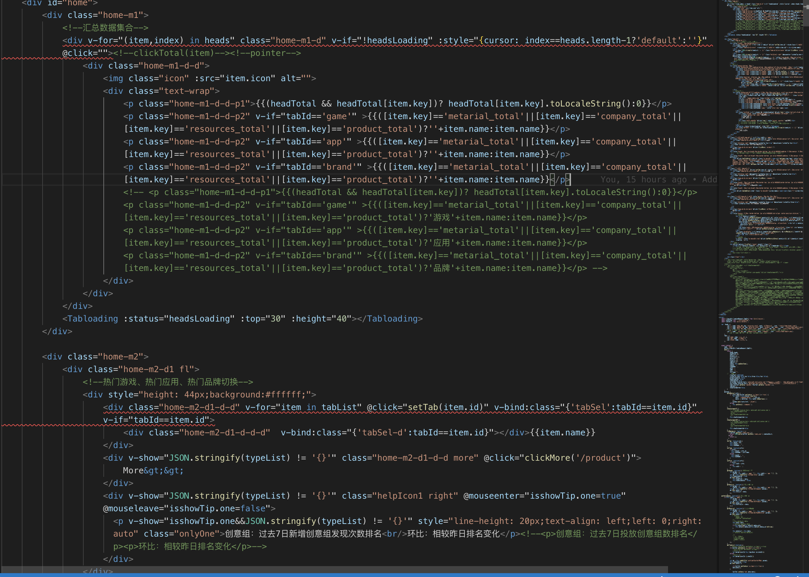

# 前端进阶--1.为什么要制定开发规范？

>

## 0 为什么要有规范？

- 与性能无关
- 与功能无关
- 与效果无关
- 与能力无关
- 与工期无关

**但是，规范必不可少**

- 与效率相关（开发、迭代和维护，重点提升维护及迭代效率）
- 与团队相关（减少团队之间的不一致性）
- 与面试相关（提高代码健壮性，通过面试）
- 与习惯相关（保证最近实践）
- 与开源相关（开源项目均有严格的开发规范）

## 1 效率

- 代码风格（eslint）
- 书写规范（eslint）

### 1.1 易读

#### 1.1.1 空格（英文、数字与中文结合）

// 不理想

```html
<p>AlexShan毕业于2008年</p>
```

// 理想

```html
<p>AlexShan 毕业于 2008 年</p>
```

> 数字、英文与中文直接左右应该留有 1 个空格

#### 1.1.2. 习惯

- 布局
  // 不好的布局风格，用行内元素包裹块级元素（新的 ESlint 规则默认禁止如此布局）

```html
<span>
  <div>
    <p><div class='strong'>不好</div>的布局风格</p>
  </div>
</span>
```

// 较好的布局

```html
<div>
  <p><strong class="strong">较好</strong>布局风格</p>
</div>
```

> 我们应该合理选择和使用`html`中的`DOM`元素进行页面布局

- 换行
  // 无换行

```html
<div
  v-vstop
  class="moreData"
  @mouseenter="showWin(index,'showindex')"
  @mouseleave="showindex=-1"
>
  <i
    class="icon iconfont icon-showdown"
    :class="{'icon-showup':showindex==index}"
  ></i>
  <i class="icon iconfont icon-left-arrow" v-show="showindex==index"></i>
  <div class="mpanel" v-show="showindex==index">
    <div
      v-for="(logo,index) in productIds"
      @click="goProDetail(logo.id)"
      :title="logo.name"
    ></div>
  </div>
</div>
```

// 换行

```html
<div
  v-vstop
  class="moreData"
  @mouseenter="showWin(index,'showindex')"
  @mouseleave="showindex=-1"
>
  <i class="icon iconfont icon-left-arrow" v-show="showindex==index"> </i>
  <div
    v-for="(logo,index) in productIds"
    @click="goProDetail(logo.id)"
    :title="logo.name"
  ></div>
</div>
```

> 我们应尽量保证代码清晰，按结构布局，如果代码密密麻麻，估计`review`的时候就会被打回来。并且严重影响阅读速度。

#### 1.1.3. 命名

| 变量                                    | 对象、类       | 常量      | 函数                  | 布尔值                     | 私有属性      |
| --------------------------------------- | -------------- | --------- | --------------------- | -------------------------- | ------------- |
| 小驼峰                                  | 大驼峰         | 大写      | 小驼峰                | 小驼峰                     | 小驼峰        |
| 区分单复数                              | 单数           |           | 动词开头              | is has can 肯定            | \_ 下划线开头 |
| myName='' colleagues=['', ''] names =[] | class DogHouse | MAX_WIDTH | createUser deleteUser | available hasUser showName | \_sum()       |
| 避免无意义变量名                        | 避免冲突       | 全局存储  | 多用肯定词            | 不对外暴露                 |

### 1.2 精简

应该尽可能让代码精简，越少的代码犯错的概率越低。维护和迭代成本也越低。

函数应该保持单一功能原则，避免大而全的函数。哪怕一个函数只有 1 行代码，也应该成为一个独立的函数。

## 2 团队

团队协作是稍具规模公司必不可少的问题，也是项目开发进度保证的重要基石。只有团队协作，各自的功力发挥到极致，才能保证团队生产力最大化。

我曾经遇到过一个团队，各自为营，都按照自己想法和风格写代码，对代码风格也没有统一，关键是并非每个人都是大佬，写出的代码仍然具有非常多的问题，也么有严格按照最近实践进行编写，我的编译器红彤彤一片。



> 这个是线上环境的真实代码，问题非常多。

1. 无用代码未及时去除
2. 未遵循`Vue.js`最佳实践进行开发[https://vuejs.org/v2/style-guide/](https://vuejs.org/v2/style-guide/)
3. 使用行内样式

我们不总结更多的存在的问题，可想而已，多人一起去维护这样一套代码，后期问题将非常多，非常有必要制定统一的规范。至少保证大家代码风格相同，否则提交代码时因格式问题也会引发大量冲突。解决冲突可不是我喜欢的事情。

## 3 面试

面试这个环节是每个开发人员都必不可少的经历，如果想进大厂，或者拿到好的薪酬。就必须通过面试，我们作为老司机，必须让自己的代码足够健壮，书写足够规范，边界条件的处理，哪怕很简单的面试题，也是能够看出一个人的编码能力的。

## 4 习惯

有人可能在偷乐，公司无规范，编码无人管，自己说了算。想怎么写就怎么写，如果你想自己一直是个码农，或者放弃自己进入大厂或者成为大牛的机会。那自然可以潇洒走下去。如果希望自己能够快速成长，何不做个领导者，领导自己，给自己给公司制定一个规范，也会让领导刮目相看。我想，好的领导，应该没有不喜欢有规范、有约束的代码风格吧？

## 5 开源

想成为开源的贡献者、或者参与开源项目，我们就必须遵守开源项目的规范。像`Angular`，连提交代码的格式和书写都有严格的要求，并且开发了自己的代码提交命令行工具。有兴趣的同学可以深入了解。
**使用`Commitizen`代替 git commit**
可以使用[cz-cli](https://github.com/commitizen/cz-cli)工具代替 git commit

## 结语

> 我们应该根据公司情况、业务场景和团队具体情况来制定适合自己的开发规范，开发规范不需要最好，也没有最好的开发规范，只有适合自己的。例如谷歌的开发规范未必适合小的、需要快速迭代的实验性项目。

> 后期我将和大家分享如何制定开发规范。
