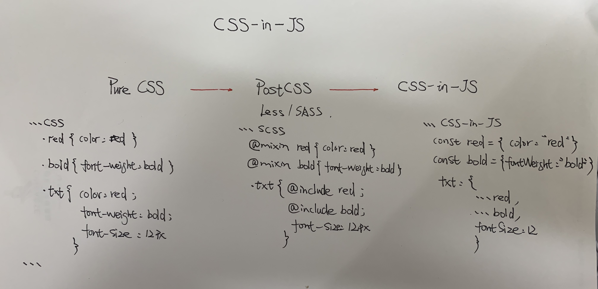
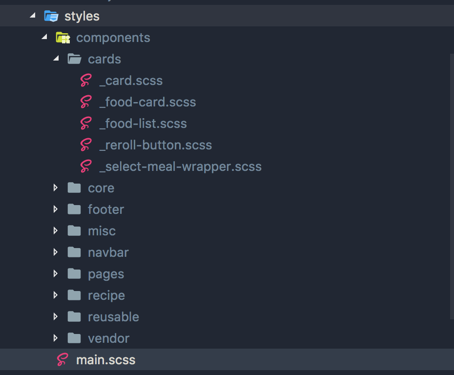
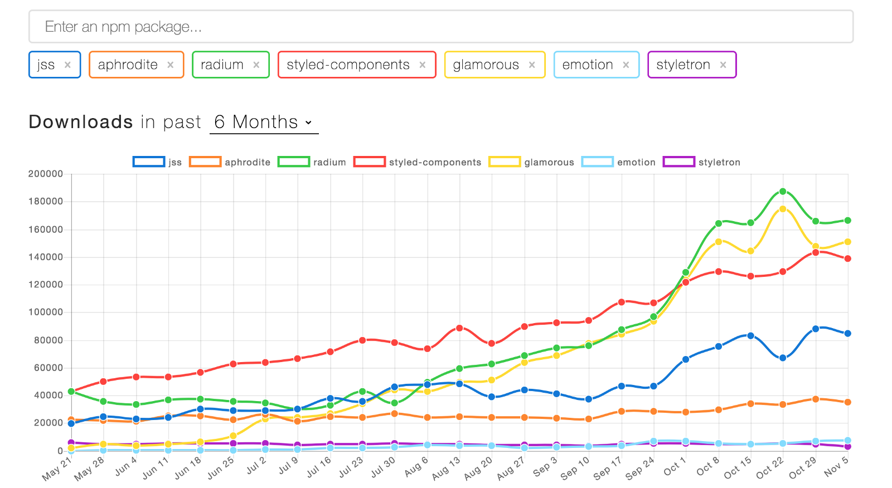

## [CSS-in-JS 你所应该知道的一切](https://medium.com/better-programming/all-you-need-to-know-about-css-in-js-984a72d48ebc)


> 用组件的方式进行思考 - 你不再需要维护一堆样式表。 CSS-in-JS将CSS模型抽象到组件级别，而不是文档级别（模块化）。
---
React 组件示例：
```jsx
import React, { Component } from 'react'
import styled from 'styled-components'

const Wrapper = styled.div`
    background: black
  `
const Title = styled.h1`
    background: white
  `
class App extends Component {
    render() {
        return (
          <Wrapper>
            <Title>Hello Styled Components!</Title>
          </Wrapper>
        )
    }
}

export default App
```
---
你很可能听过像`CSS-in-JS`, `Styled Components`,`Radium`, 和`Aphrodite`，你可以也会想，这和我有什么关系？我非常乐于写`CSS-in-CSS`(纯.css文件)。

我来说一下这些为什么和你有关，希望至少能懂得概念，了解为什么和你有关。话虽如此，请随意使用CSS-in-CSS。你没有义务使用CSS-in-JS。无论什么最适合你，让你很爽，总是能够提供最好的解决方案！

CSS-in-JS是一个微妙而有争议的话题。 我主张开放的思想，并考虑这是否对你有意义。 问问自己，“它会改善我的工作流程吗？”最后，唯一重要的是使用能让你更快乐，更高效的工具。

我总是觉得难以维护一个巨大的样式表文件夹。 我想尝试不同的方法。 我见过很多人问是否有新的造型想法。 到目前为止，CSS-in-JS是最好的概念。

让我们一起看下CSS-in-JS:



中小型项目的 CSS

---
## 1.什么是CSS-in-JS？
> [JSS是一种比CSS更强大的抽象](https://medium.com/@oleg008/jss-is-css-d7d41400b635)。 它使用JavaScript作为语言以声明和可维护的方式描述样式。 它是一个高性能的JS到CSS编译器，它在运行时和服务器端工作。 这个核心库是低级别和框架无关的。 它大约是6KB（缩小和压缩），并且可以通过插件API进行扩展。 - [来源](https://cssinjs.org/?v=v10.0.0-alpha.21)

一定要铭记，**行内样式**和**CSS-in-JS**完全不同，如下图所示：
### 1.1 行内样式如何工作？
在浏览器中，这将附加到DOM节点，如下所示：
```html
<span style="color: green">inline style</span>
```

### 1.2 CSS-in-JS如何工作？
在浏览器中，这将附加到DOM节点，如下所示：
```html
<style>
.jss-xxx-green{
  color: green
}
</style>

<span class='jss-xxx-green'>inline style</span>
```

### 1.3不同点：
看到细微的区别？         `CSS-in-JS`在DOM的顶部附加了一个`<style>`标记，而内联样式只是将属性附加到DOM节点。
为什么这很重要？

并非所有`CSS`功能都可以使用`JavaScript`事件处理程序。 许多伪选择器（如：disabled，：before，：nth-child）是不可能的，不支持样式化`html`和`body`标签等。

使用`CSS-in-JS`，您可以轻松获得`CSS`的所有功能。 由于生成了实际的`CSS`，因此您可以使用您能想到的每个媒体查询和伪选择器。 一些库（如`jss`，样式组件）甚至添加了对嵌套的整洁，非`CSS`原生特性的支持！

为什么我们不使用`CSS-in-CSS`并完成它？

虽然长期以来一直如此，但挑战在于现代网络是用组件而不是页面编写的。

CSS实际上从未实现过基于组件的方法。 `CSS-in-JS`正好解决了这个问题。 

## 2.使用`CSS-in-JS`有什么好处？
- 组件化思考。你不再需要维护一堆样式表。 CSS-in-JS将CSS模型抽象到组件级别，而不是文档级别（模块化）。
- `CSS-in-JS`利用JavaScript生态系统的全部功能来增强CSS。
- 真正的规则隔离。 范围选择器是不够的。 如果没有明确定义，CSS具有从父元素自动继承的属性。 感谢`jss-isolate`插件，JSS规则不会继承属性。
- 范围选择器。 CSS只有一个全局命名空间。 在非平凡的应用程序中不可能避免选择器冲突。 命名约定（如`BEM`）可能在一个项目中有所帮助，但在集成第三方代码时无效。 当JSS将JSON表示编译为CSS时，JSS默认生成**唯一的类名**。
- 自动添加前缀。CSS规则自动以`provider`为前缀，因此您不必考虑它。
- 代码共享。轻松地在JS和CSS之间共享常量和函数。
- 只有屏幕上当前使用的样式位于DOM（[react-jss](https://github.com/cssinjs/react-jss)）中。
- [消除未使用代码](https://en.wikipedia.org/wiki/Dead_code_elimination)
- CSS单元测试

## 3.使用CSS-in-JS的缺点是什么？
- 学习曲线
- 新的依赖
- 让新队友更难适应代码库。 不熟悉前端的人必须学习更多东西。
- 挑战现状（不一定是骗局）。

> 优势明显超过了利弊 - 让我们给JS-in-JS一个机会！

## 4. 最受欢迎的`CSS-in-JS`库
所有流行的CSS-in-JS库的快速“Hello World”示例。 根据语法选择您最喜欢的一个。



- Styled Components
- [JSS-React](https://github.com/cssinjs/react-jss)
- [Glamorous](https://glamorous.rocks/)
- Radium (Caveat: Uses Inline Styles)
- Aphrodite
- Styletron

这些是非常简单的示例，展示了核心功能。 所有库都包含更多功能，例如主题，动态道具，服务器端渲染等等。

## 结论和资源
我相信CSS-in-JS应该有机会。 希望这篇文章对你有所帮助，并感谢阅读！

深入阅读请移步：
- [Airbnb JavaScript Style Guide](http://airbnb.io/javascript/css-in-javascript/)
- [CSS in JS: Benefits, Drawbacks, and Tooling](https://medium.com/object-partners/css-in-js-benefits-drawback-and-tooling-80286b03f9aa)
- [awesome-css-in-js](https://github.com/tuchk4/awesome-css-in-js)