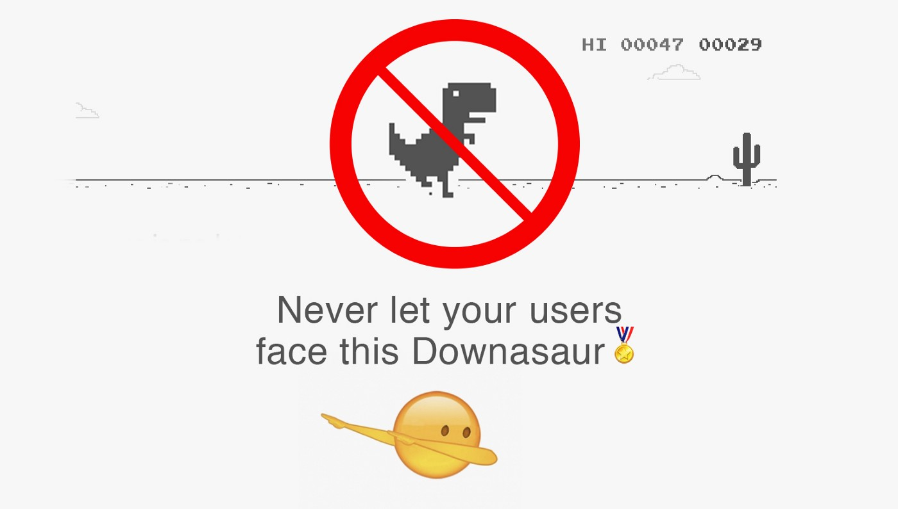
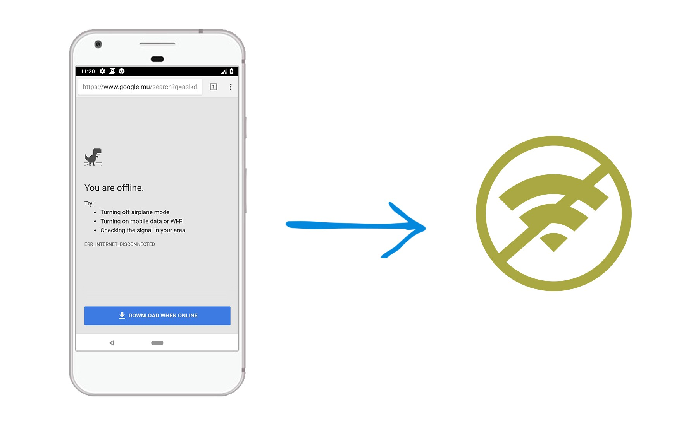
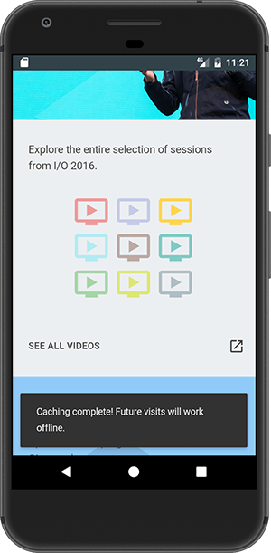
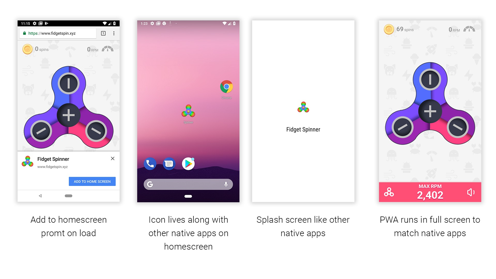
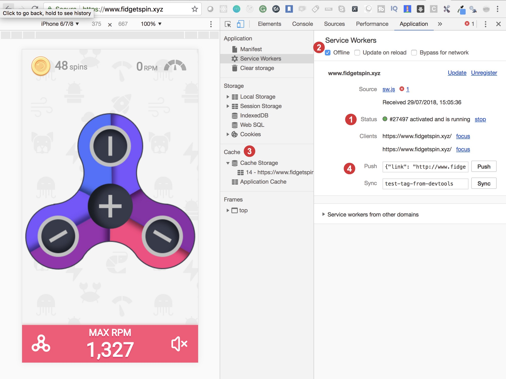

## [「译文」：什么是PWA，我们为什么要重视？](https://juejin.im/post/5ea3a8d951882573b436260c)

[PWA（`PWA` - Progressive Web Apps）](https://web.dev/progressive-web-apps/)

> 注：以下全文简称 PWA

## 历史

在过去的几年中，手机用户数量呈指数增长。 如今，超过[60％](https://www.statista.com/statistics/284202/mobile-phone-internet-user-penetration-worldwide/)的互联网总使用量通过手机进行。

显然，原因包括可移植性，廉价的硬件，易于访问的Internet和Internet服务数量的增加。 随着移动用户数量的增加，优化移动用户体验至关重要。

对于因成本或时间限制而通常没有移动应用程序的小型公司，Web应用程序是他们通过提供最佳体验来赢得客户的主要机会。

虽然公司拥有专门的原生移动应用程序，但是由于用户硬件和内存限制或某些其他个人喜好，很多用户可能会更喜欢其Web版本来避免下载和安装。

```如果一家公司专注于并希望获得最大的参与客户，则Web应用程序的体验必须接近于原生应用程序。```

如今，我们对网站的期望很高。 大约25年前，当网站被发明时，其目的主要是共享信息。
今天，该网站已成为杂货店，社交网络，聊天场所，而无所不能。 有的网站能搜索房屋并保存世界地图。有的网站提供`Powerpoint`和`Excel Sheet`的所有功能。

## `PWA`要求

让我们以手机上的`Whatsapp`为例。 在没有网络的情况下，您仍然可以打开应用程序，检查过去的消息，甚至回复某人。 当电话获得Internet连接时，消息将在后台自动发送。

这就是`PWA`承诺在Web应用程序中提供的内容。 它使Web应用程序可以在没有网络的情况下进行加载，在后台同步并无缝地执行操作，同时为用户提供类似本机的体验。



## 为什么我们需要PWA？及其功能？

让我们讨论一些常见的非`PWA`所缺少的核心属性。

### 1. 可靠

该应用程序在加载时应闪电般快速，应接近瞬时，并且在没有网络或`2G`等相当低速的网络时也应打开。 Google发现，如果网页加载时间超过**3秒**，则53％的用户会放弃该网站。

### 2. 快速

当用户与Web应用程序交互时，滚动和页面过渡应平滑流畅。 每个人都讨厌糟糕的滚动。

### 3. 反应灵敏

该应用程序应适合所有不同大小的设备。 完美的Web应用程序应该像液体一样，操控顺滑。

### 4. 可安装

如果我们想使Web应用程序更接近于本机应用程序，则它们必须是可安装的，并且应与其他本机应用程序一起位于主屏幕中，以便用户可以一键访问`PWA`。*--译者注：iPhone4 就支持将Web 页面保存到主屏幕中，以类App 的形式打开*

### 5. 开机画面

`PWA`在应用程序启动期间添加了一个初始屏幕。 这使`PWA`更像是本机应用程序😉

### 6. 高度参与

该应用程序应保持用户的参与度。 `PWA`提供**推送通知，主屏幕图标，全屏和离线优先**应用程序等功能，以美化用户参与度。

以上所有特性在`PWA`中都是可能的。

```PWA只是一个常规的Web应用程序，运用了最新的技术并大幅提升了用户体验```

## `PWA`和现代UI框架

很少有人认为`PWA`最新的UI框架（如ReactJs，Angular 8或Vue.js）结合在一起。 好吧，不一定。 `PWA`与您使用的框架无关，它仅需要必需的组件。

## `PWA`如何使网站可以离线使用？

那正是我对`PWA`的第一个想法。 没有互联网，如何打开Web应用程序？

我们都知道本机应用程序可以在没有互联网连接的情况下打开，因为当我们下载并安装本机应用程序时，诸如UI组件和一些数据之类的关键资源都存储在设备中……。 嗯，这正是`PWA`中发生的情况😀

`PWA`将HTML文件，CSS文件和图像存储在浏览器缓存中，并且开发人员可以完全控制网络调用。 所有这些都是由`Service Worker`实现的。

## `PWA`有什么组成？

`PWA`具有一些重要的技术组件，这些组件可以协同工作并激发常规Web应用程序的活力。 开发良好的`PWA`需要以下组件。


### 让我们对其进行一一讲述。

#### 1. `Service Worker`

我们的Web应用程序直接与网络对话，如果没有网络，屏幕将显示著名的恐龙。



*当我们的普通网络无法连接到互联网时显示*

这是优化此过程的机会。 

对于首次加载，`Service Worker`将所需的资源存储在浏览器缓存中。 当用户下次访问该应用程序时，`Service Worker`甚至在检查网络之前，都会检查缓存并将响应返回给用户。
`Service Worker`只是`JavaScript`代码的一部分，它充当浏览器和网络之间的代理。 `Service Worker`可以管理推送通知，并使用浏览器的缓存API帮助构建离线的第一个Web应用程序。


*这就是`Service Worker`如何履行其职责以增强常规网站的能力*

无论设备是否已连接到互联网，这都可以提高应用程序的性能。
开发人员可以完全控制应用程序的行为以及在各种情况下应如何响应。 `Service Worker`有其自己的生命周期事件。



缓存完成并准备进行脱机访问后，您还可以通过显示注释说明缓存已完成，并且用户也可以脱机访问该缓存，从而选择吹嘘它。

#### 2. 清单文件`manifest.json`

清单文件是一个配置JSON文件，其中包含您的应用程序信息，例如安装后在主屏幕上显示的图标，应用程序的简称，背景色或主题。

如果清单文件存在，Chrome浏览器将自动触发Web应用程序安装横幅，如果用户同意，这会将图标添加到主屏幕并安装`PWA`。 这不是专横吗？ 😎

以下是示例清单文件：

```json
{
  "short_name": "Spinner",
  "name": "Fidget spinner",
  "icons": [
    {
      "src": "/images/icons-192.png",
      "type": "image/png",
      "sizes": "192x192"
    },
    {
      "src": "/images/icons-512.png",
      "type": "image/png",
      "sizes": "512x512"
    }
  ],
  "start_url": "/home/?source=pwa",
  "background_color": "#3367D6",
  "display": "standalone",
  "scope": "/home/",
  "theme_color": "#3367D6"
}
```

在以下屏幕截图中检查清单文件的作用。



#### 3. `HTTPS`

`Service Worker`可以拦截网络请求并可以修改响应。 `Service Worker`在客户端执行所有操作。 因此，`PWA`需要安全协议`HTTPS`。

`Service Worker`能够接收推送通知和后台同步，这无疑会增加用户体验并保持客户参与度。 推送通知和后台同步是可选的，但建议您提供更原生的体验。

### Demo 时间

如今，有许多可用的`PWA`。 如果您想体验`PWA`并希望看到`Service Worker`在行动，请访问[fidgetspin.xyz](https://www.fidgetspin.xyz/)并切换到Chrome开发工具中的“应用程序”标签。



1. 状态`Status`：
告诉我们`Service Worker`已激活并正在运行。

2. 离线`Offline`：
通过选中此选项，Chrome将应用视为离线。 刷新选项卡，它将模拟没有网络时`PWA`的响应方式。 您也可以关闭`wifi`或数据以测试`PWA`。

3. 缓存`Cache`：此部分显示`Service Worker`将所有文件存储在缓存中的内容。

4. 推送和同步`Push & Sync`：这些部分在开发过程中用于测试推送通知和后台同步。

您可以访问[https://pwa.rocks/](https://pwa.rocks/)，其中包含了很多`PWA`应用程序。

### 工具和库

几乎没有可用的开源工具可以增强`PWA`并使之易于开发。

1. [`Lighthouse`](https://developers.google.com/web/tools/lighthouse/)是一种审核工具，可以在任何公共或个人网页上运行，并生成一份包含`PWA`所需清单的报告。 可以在开发`PWA`时使用它进行交叉检查，并获取建议以进一步改善体验。

2. [`Workbox`](https://developers.google.com/web/tools/workbox/)是由Google开源的库的集合，可用于生成`Service Worker`文件。 `Workbox`还附带了各种图像和其他资源的缓存策略。

### `PWA`的成功故事

Google会发布实施`PWA`的公司的成功案例。 

访问[此页面](https://developers.google.com/web/showcase/)以阅读更多有关公司如何解决问题以处理缓慢的网络，如何优化用户体验以及如何将转换和SEO性能提高多达**80％**的更多信息。

这展示了全球多家公司面临的各种问题以及他们如何使用`PWA`解决该问题。 我很确定您会获得有关`PWA`如何对您有所帮助的指导。

如果您有任何疑问或建议，请随时在下面发表评论，如果您喜欢这篇文章，请考虑鼓掌👏。 继续学习和分享😊

### 原文地址: [What is a PWA and why should you care?](https://blog.bitsrc.io/what-is-a-pwa-and-why-should-you-care-388afb6c0bad)
