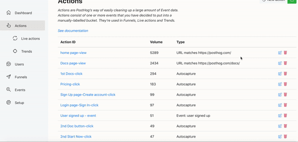
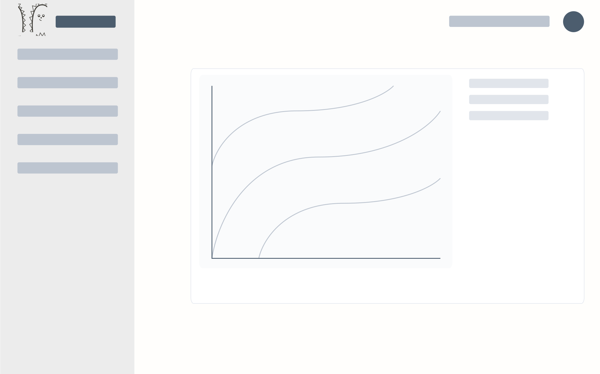
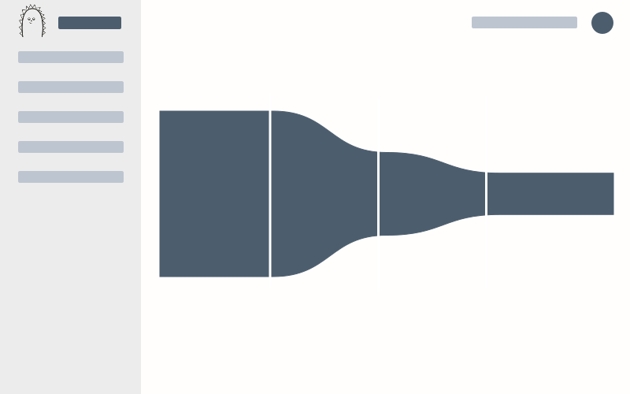

# 用户行为分析之最佳实践-PostHog


## 一、需求提出及评审

- PM：我有一个紧急需求，是老板提出来的
  - 我想知道每一个用户正在做什么？
  - 我想知道用户从登录，到`A`页面的转化率是多少？
  - 我想知道用户在`A`页面时，更喜欢咱们的哪个功能？功能 A or 功能 B？
  - 越快越好，最好是今天可以上线
- FE：~~对不起我做不到~~ **好的，下班前上线**
- PM：大佬你真厉害👍，下次有需求还找你
- FE：额

## 二、需求分析

- 看似产品提了多个需求，其实就是一个，**用户行为分析**。
- **用户行为分析**的原理，就是上报用户的每一次行为事件，对事件进行分类、过滤及处理
- 自己开发？不推荐，涉及众多问题，如：性能，稳定性，兼容性，归因等。
- 所以我们选择拿来主义，直接推荐[PostHog](https://posthog.com/)--**开源**产品分析工具

## 三、`PostHog`介绍

### 1. 是一款开源的产品分析（我认为，叫用户行为分析工具）更合适

### 2. 可以知道每一个用户正在做什么



### 3. 自定义展示数据


### 4. 提升转化率

通过自定义漏洞或者其它`Actions`，达到类似 A/B test 的效果，选择更佳实现方案

## 四、项目部署

- 此处省略，部署方案非常简单和灵活，大家可以看官网[PostHog](https://posthog.com/)

## 五、`SDK`接入及事件上报埋点

1. 设置`PostHog`账号，输入`PostHog`将用于的`URLs`
2. 接入`Integrate PostHog`
3. 初始化`posthog.init`

```js
<script src="https://yourhostname/**/array.js"></script>
<script>
   posthog.init(APIkey, {api_host: 'https://yourhostname'})
</script>
```

3. 如果前端项目是类似`Vue`或者`React`的`SPA`，需要注意，由于是单页面，需要监听路由变化，实时上报用户数据`posthog.capture`

```js
  watch: {
    $route(newRoute, oldRoute) {
      // ... 处理其它自定义业务
      if (typeof posthog !== 'undefined' && isProduction) {
        posthog.capture('$pageview')
      }
    }
  }
```

4. 上报用户名或其它用户信息`posthog.identify`。

- 上报后，就可以在`Events`中查看到每个事件的真实用户。
- 这点真心有用，再也不需要问用户索要`Account ID`来复现`bug`了。
- 当然，还可以挖掘谁才是潜在的重要客户。

```js
  this.handleLogin(params)
    .then(res => {
      // 将用户名上报
      if (typeof posthog !== 'undefined' && isProduction) {
        posthog.identify(username)
      }
    })
```

## 六、自定义用户`Users`、事件`Events`、行为`Actions`、趋势`Trends`、漏斗`Funnels`

> 登录到已经部署好的`PostHog`管理后台

### 1. 用户`Users`，挖掘潜在优质用户

1. 基础信息 

- 用户是最重要的信息，一切的数据都是为了更好地服务用户，我们可以在用户`Tab`，下面看到用户的信息（如：用户名，最后登录时间等），用户名就是我们前面在用户登录时上报的信息。

2. 自定义人群`Cohorts`

- 可以根据用户的行为，以及时间两个维度自定义人群，如：周活跃用户

### 2. 事件`Events`，知道用户正做什么

- 事件是用户行为的基石，拥有用户的事件，就可以进行深度加工，分析用户的一切行为。
- 所以，我们可以更加用户的事件，来定义行为`Actions`

### 3. 行为`Actions`，跟踪哪个功能更受欢迎

- 我们可以根据设定的行为，来定义趋势趋势`Trends`或者漏斗`Funnels`




### 4. 漏斗`Funnels`，知道用户在哪离开

- 创建漏斗，知道用户在哪个环节离开的最多，知道转化率



## 总结

- 就这样，你就可以按时保质保量，完成产品的需求了。
- PM或者Boss可以根据自己的需求，自定义行为、趋势等。
- `PostHog`确实是一款非常不错的用户行为监测及分析产品，开发、配置、使用均很便捷，自定义也很方便。
