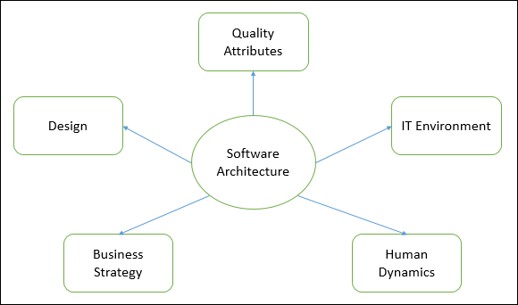
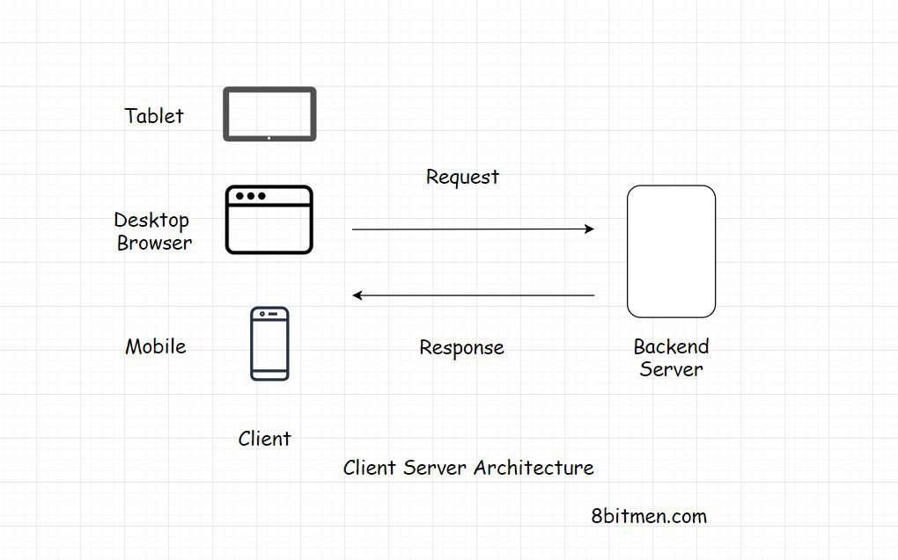
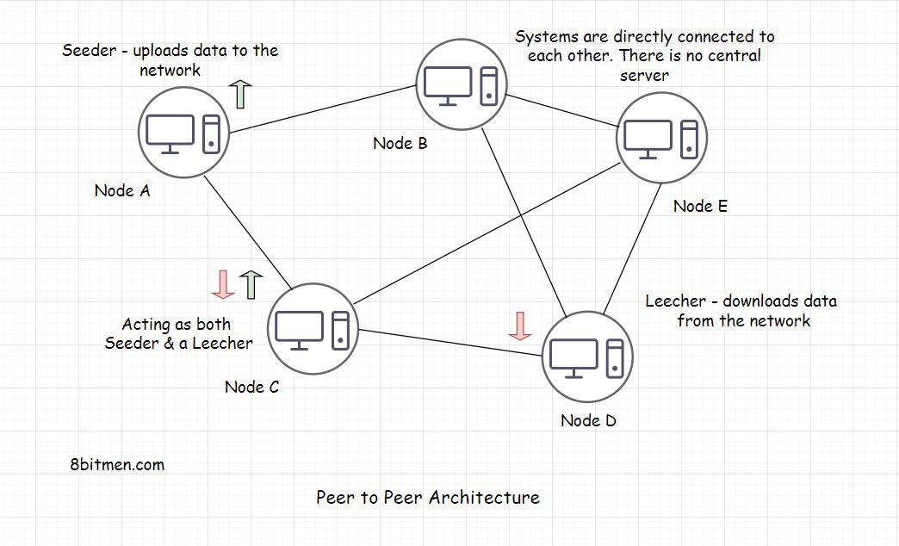
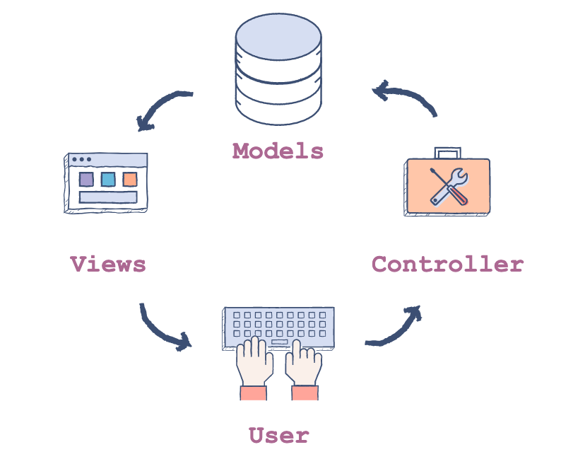
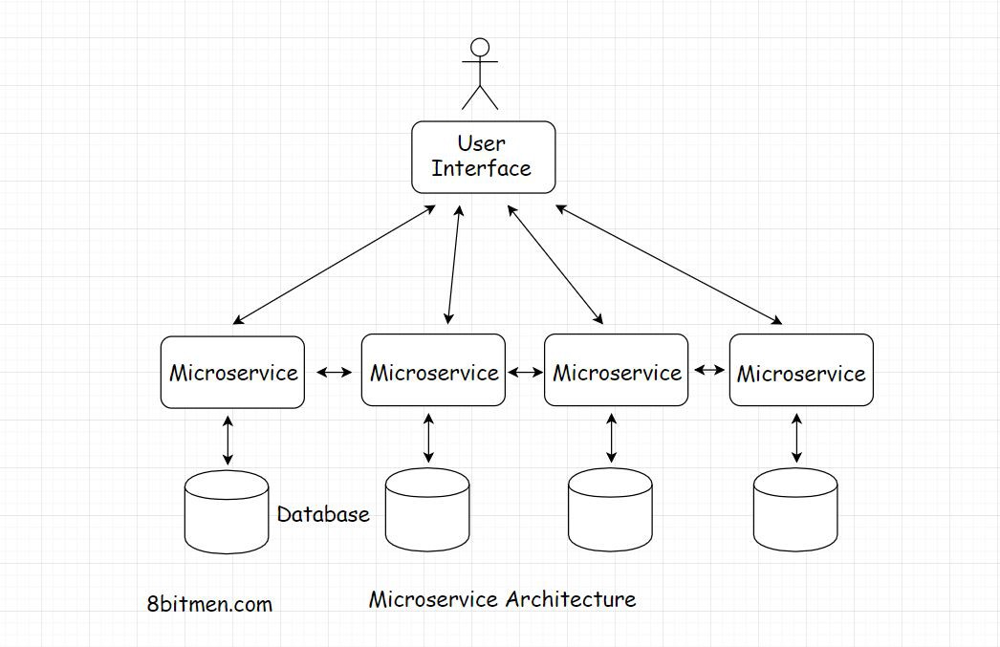
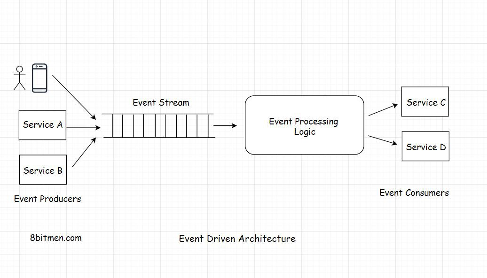
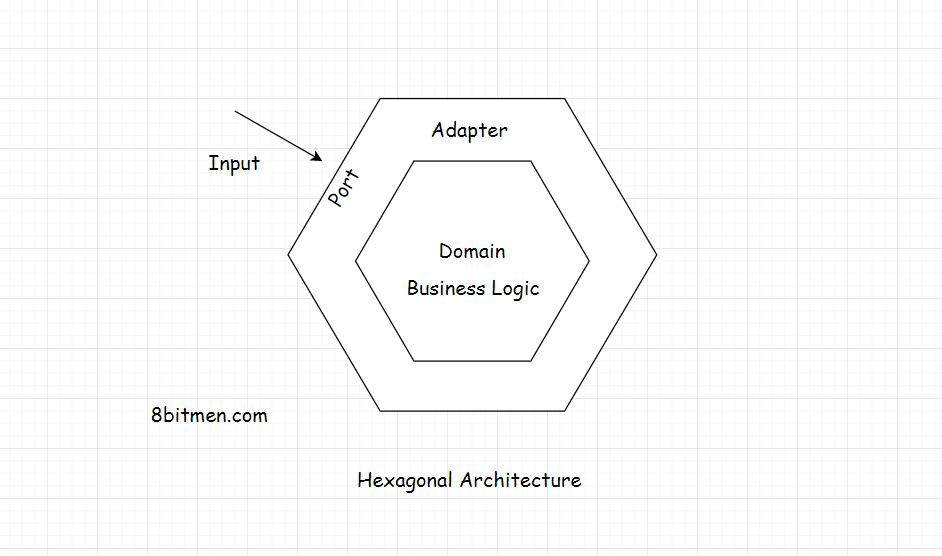
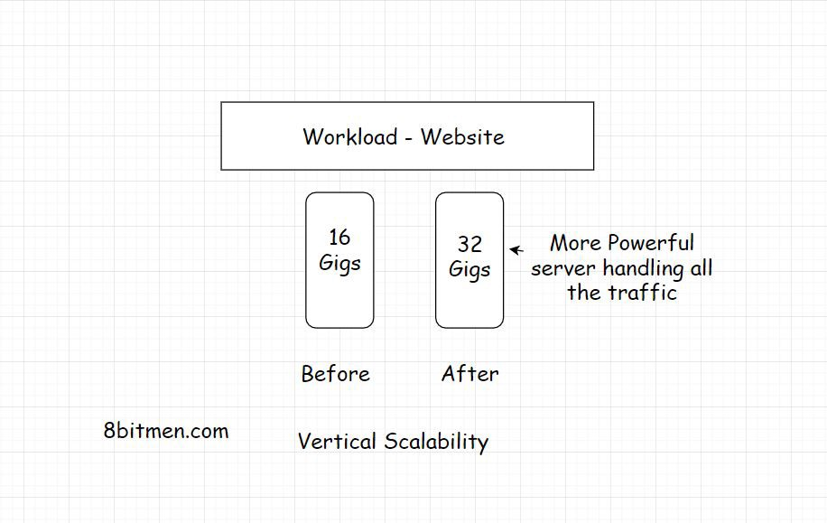
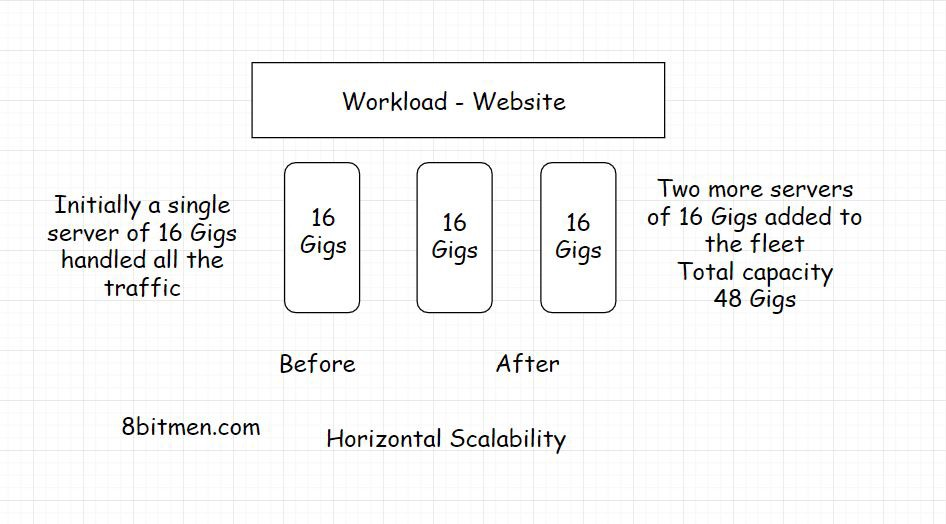

# 「译」如何设计Web应用程序：成为软件架构师？

**在项目早期做出正确的决定**

---
因此，您已踏上了创业之旅，并决定构建自己的Web应用程序。 您有一个主意，但是现在正确构建体系结构至关重要。

在本文中，我们将介绍以下关键领域：

- 什么是软件架构？
- 为什么软件架构很重要？
- 软件架构和软件设计之间的区别。
- 软件架构模式。
- 如何确定应用程序应具有的层数。
- 水平或垂直缩放-适用于您的应用程序？
- 单体还是微服务？
- 什么时候应该使用`NoSQL`或`SQL`？
- 为工作选择合适的技术。
- 如何成为软件架构师？
- 如何开始行动？

我们的目标是使您对Web架构，所涉及的概念以及在设计应用程序时如何选择正确的架构和技术有深入的了解。 到本篇文章的最后，当您不得不从根本上设计应用程序时，您将不会陷入一片黑暗。

如果您正在寻找有关Web应用程序和软件架构的完整课程，我们建议您阅读[Web应用程序和软件架构101](https://www.educative.io/courses/web-application-software-architecture-101)。对于希望增强其软件架构总体知识的任何人来说，这都是一门有用的课程。

让我们开始吧！

## 什么是软件架构？

系统的软件架构描述了其主要组件，它们之间的关系以及它们之间的交互方式。

本质上，它是一个蓝图。 它提供了一种抽象来管理系统复杂性。 它在组件之间建立通信和协调。

### 一些要点：

该体系结构有助于定义一个满足所有技术和运营要求的解决方案，其共同目标是针对性能和安全性进行优化。

设计架构涉及组织需求与开发团队需求的交叉。 每个决定都会对质量，可维护性，性能等产生重大影响。

我最喜欢的软件架构定义之一是《设计模式：可重用的面向对象软件的元素》的合著者Ralph Johnson。

> *这是您希望在项目早期就能做出的正确决定。*

## 为什么软件架构很重要？

建造建筑物或做披萨（要成功创建任何东西），您需要确定基础。 如果您没有找到正确的基础，而又出了点问题，那么您只需要重新开始，就无法解决它。

构建Web应用程序没有什么不同。 该体系结构是基础。 应该仔细考虑一下，以避免重大的设计更改和以后的代码重构。

**许多工程师会告诉您：您不需要重新设计内容。 它像黑洞一样吞噬了您的时间。 它有可能将您的发货日期推迟数月（甚至更长）。** 而且，这还没有算上工程和财务资源的浪费。

在初始设计阶段做出仓促的决定可能会在开发过程的任何阶段造成僵局。 因此，在我们不熟悉代码之前，我们必须正确构建基础架构。

软件开发是一个迭代和进化的过程-我们并不总是一开始就把事情做到完美。 但这不是没有做准备的借口。

## 软件架构和软件设计之间的区别

软件设计和软件架构之间经常会混淆。 让我们来分解一下。

**软件架构**用于定义系统的**框架和高级组件**以及它们如何协同工作。 

例如，您是否需要一种无服务器架构，将应用程序分为两个组件：`BaaS`（后端即服务）和`FaaS`（功能即服务）？ 还是您需要像微服务体系结构这样的东西，将不同的功能/任务划分为各自独立的模块/代码库？

**选择架构将决定您如何处理性能，容错能力，可伸缩性和可靠性。**

**软件设计**负责代码级设计-每个模块在做什么，类范围以及功能，目的等。有策略地使用它们时，它们可以使程序员更高效，并为他们提供已经过完善的方法。 其他的，所以他们不必继续创新。

此外，当与他人讨论或在较大的团队中管理代码时，他们提供了有用的通用语言来概念化重复出现的问题和解决方案。 通过以下有用的课程开始利用代码中的软件设计模式：软件设计模式：面向软件开发人员的最佳实践。

这是一篇很好的文章，介绍了软件设计的重要性以及开发人员经常使用的可靠模式：[7种最重要的软件设计模式。](https://www.educative.io/blog/the-7-most-important-software-design-patterns)

## 软件架构模式

## 一、客户端服务器

该体系结构基于请求-响应模型。 客户端将请求发送到服务器以获取信息，然后服务器对此做出响应。

您浏览的每个网站，无论是`Wordpress`博客，`Facebook`或`Twitter`之类的`Web`应用程序，还是您的银行业务应用程序，都建立在客户端-服务器架构上。

## 二、点对点

`P2P`网络是其中计算机（也称为节点）可以相互通信而无需中央服务器的网络。 没有中央服务器，排除了单点故障的可能性。 网络中的所有计算机都具有平等的权利。 节点同时充当播种者和移交者。 因此，即使某些计算机/节点出现故障，网络和通信仍然正常。
`P2P`是区块链技术的基础。

## 三、模型视图控制器（`MVC`）

`MVC`体系结构是一种软件架构模式，其中，根据功能将应用程序逻辑分为三个组件。 这些组件称为：

- 模型`Model`-表示数据如何存储在数据库中。
- 视图`View`-用户可见的组件，例如输出或GUI。
- 控制器`Controller`-充当模型和视图之间的接口的组件。

`MVC`体系结构不仅用于桌面应用程序，而且还用于移动和Web应用程序。

## 四、微服务

在微服务体系结构中，不同的功能/任务被分成各自独立的模块/代码库，这些模块/代码库与每个模块/代码库一起工作以形成一个完整的大型服务。

与整体架构相比，此架构可简化和维护应用程序，简化功能开发，测试和部署。

## 五、事件驱动

非阻塞架构也称为反应式或事件驱动架构。 事件驱动的体系结构在现代Web应用程序开发中非常流行。

他们能够以最少的资源消耗处理大量并发连接。 现代应用程序需要完全异步的模型来进行扩展。 这些现代的Web框架在分布式环境中提供了更可靠的行为。

## 六、分层的

此模式可用于构造可分解为子任务组的程序，每个子任务处于特定的抽象级别。 每一层都向下一层提供服务。

### 最常见的层是：

- 表示层
- 应用层
- 业务逻辑层
- 资料存取层

## 七、六角形

### 该体系结构包含三个组件：

- 港口
- 转接器
- 域

该体系结构的重点是使应用程序的不同组件独立，松散耦合且易于测试。

架构模式将域作为核心，这就是业务逻辑。 在外部，外层具有端口和适配器。 端口就像一个API，充当接口。 应用程序的所有输入都通过界面进行。

## 您的应用应具有多少层？

### 单层应用

#### 优点：

- 没有网络延迟。
- 数据快速便捷
- 数据不通过网络传输，确保数据安全。

#### 缺点：

- 对应用程序的控制很少-交付后很难实施新功能或更改代码。
- 测试必须非常彻底，并且要有最小的错误余地。
- 单层应用程序容易受到调整或反向工程。

### 两层应用

#### 优点：

- 由于代码和用户界面位于同一台计算机上，因此网络呼叫减少
- 数据库服务器和业务逻辑在物理上紧密相连，可提供更高的性能。

#### 缺点：

- 由于客户端拥有大多数应用程序逻辑，因此在控制软件版本和重新分发新版本时会出现问题。
- 由于它仅支持有限数量的用户，因此缺乏可伸缩性。 当多个客户端请求增加时，由于客户端需要单独的连接和CPU内存才能继续进行，因此应用程序性能可能会降低。
- 由于应用程序逻辑与客户端结合在一起，因此很难重用逻辑。

### 三层应用

#### 优点：

- 可以消除通过客户端应用程序造成的数据损坏，因为在中间层传递的用于数据库更新的数据可确保其有效性。
- 业务逻辑在中央服务器上的放置使数据更加安全。
- 由于应用服务器的分布式部署，系统的可伸缩性得到了增强，因为不需要与每个客户端建立单独的连接，而来自几个应用服务器的连接就足够了。

#### 缺点：

- 通常，随着通信点的增加（从客户端到中间层到服务器，而不是直接从客户端到服务器），在创建三层应用程序时应加大工作量，而通过Visual Basic，PowerBuilder，Delphi等工具可以提高性能。 减少。

### `N`层应用

#### 优点：

- 三层架构的所有优点。
- 由于减轻了数据库层和客户端层的负担，因此性能得到了提高，使其适合中大型企业。

#### 缺点：

- 由于层的组件化，因此复杂的结构难以实现或维护。

### 结论

当您不希望任何网络延迟时，应选择单层体系结构。

当您需要最小化网络延迟并且需要对应用程序中的数据进行更多控制时，请选择两层应用程序。

当您需要控制应用程序的代码/业务逻辑，希望它是安全的并且需要控制应用程序中的数据时，应该选择三层体系结构。

当您需要应用程序扩展和处理大量数据时，应选择N层体系结构。

## 水平或垂直缩放-哪种适合您的应用程序？

如果您的应用程序是一种实用程序或工具，预期会收到最少的一致流量（例如，组织中的内部工具），则可能不需要将其托管在分布式环境中。 单个服务器足以管理流量，并且您知道流量负载不会显着增加。 在这种情况下，请进行垂直缩放。

但是，如果您的应用程序是面向公众的社交应用程序，例如**社交网络，健身应用程序或类似的应用**程序，那么预计访问量在不久的将来会呈指数级增长。 在这种情况下，高可用性和水平可伸缩性对您都很重要。

进行构建以将其部署到云上，从一开始就始终牢记水平可伸缩性。 [这是一个很好的网站，可让您更多地了解可扩展性。](http://highscalability.com/)

## 单体还是微服务？

让我们探讨一下应如何选择？

### 何时使用单体架构

当要求很简单并且预计该应用程序只能处理有限的流量时，单块应用程序最适合。 例如，用于组织的内部税收计算应用程序或类似的开放式公共工具。

在这些用例中，企业可以确定用户群和流量不会随着时间呈指数增长。

在某些情况下，开发团队决定从整体架构开始，然后再扩展到分布式微服务架构。

这有助于他们在需要时逐步解决应用程序的复杂性。 这正是LinkedIn所做的。

### 何时使用微服务架构

微服务架构最适合复杂的用例以及希望流量在未来呈**指数增长**的应用程序，例如精美的社交网络应用程序。

典型的社交网络应用程序具有各种组件，例如消息传递，实时聊天，实时视频流，图像上传，点赞和分享功能等。在这种情况下，请牢记分别开发每个组件，并在其中保持单一职责和关注点分离原则。

写入单个代码库的每个功能都不会花费时间就变成一团糟。

现在，我们已经通过了三种方法来实现整体和微服务：

- 选择一个整体架构。
- 选择微服务架构。
- 从整体架构开始，然后再扩展到微服务架构。

选择单体或微服务架构在很大程度上取决于我们的用例。 我建议您使事情保持简单，并对需求有透彻的了解。 铺垫土地，**仅在需要时才构建某些东西，并不断迭代开发代码。** 那是正确的方法。

## 什么时候应该使用`NoSQL`或`SQL`？

### 何时选择`SQL`数据库？

如果您正在编写股票交易，银行业务或基于金融的应用程序，或者您需要存储很多关系，例如，在编写诸如`Facebook`之类的社交网络应用程序时，则应选择一个关系数据库。 原因如下：

#### 事务和数据一致性

如果您要编写与金钱或数字有关，可以进行交易或必须遵守`ACID`的软件，那么数据一致性对您来说至关重要。 关系数据库在事务和数据一致性方面大放异彩-它们符合`ACID`规则，已经存在了很长一段时间，并且经过了实战测试。

#### 储存关系

如果您的数据有很多关系，例如您的哪个朋友住在一个特定的城市？ 您中哪个朋友已经在您计划今天访问的餐厅用餐？ 等等，没有什么比关系数据库存储这种数据更好的了。

建立关系数据库以存储关系。 它们已经过试用和测试，并被诸如`Facebook`之类的业界大手枪用作主要的面向用户的数据库。

#### 流行的关系数据库

- `MySQL`
- `Microsoft SQL Server`
- `PostgreSQL`
- `MariaDB`

### 何时选择`NoSQL`数据库

#### 为什么要选择`NoSQL`数据库有几个原因。

#### 处理大量读写操作

当您需要快速扩展时，请考虑使用`NoSQL`数据库。 例如，当您的网站上有大量读写操作并且处理大量数据时，`NoSQL`数据库最适合这些情况。 由于它们具有动态添加节点的能力，因此它们可以以最小的延迟处理更多的并发流量和大量数据。

#### 运行数据分析

`NoSQL`数据库也最适合数据分析用例，在这种情况下，我们必须**处理大量数据**。

#### 流行的`NoSQL`数据库

- `MongoDB`
- `Redis`
- `Cassandra`
- `HBASE`

如果您对尝试使用像`MongoDB`这样的`NoSQL`数据库感到好奇，我强烈建议您查看[Nikola Zivkovic的课程《 MongoDB权威指南》。](https://www.educative.io/courses/definitive-guide-to-mongodb)

## 为工作选择合适的技术

### 实时数据交互

如果您要构建的应用程序需要：

- 与后端服务器实时交互，例如消息传递应用程序或诸如`Spotify`，`Netflix`等的音频视频流应用程序。
- 客户端和服务器之间的持久连接，以及后端的非阻塞技术。

然后，使您能够编写这些应用程序的一些流行技术是`NodeJS`和称为`Tornado`的流行`Python`框架。 如果您在`Java`生态系统中工作，则可以查看`Spring Reactor`，Play和Akka.io。

### 对等`Web`应用程序

如果您打算构建对等网络应用程序，例如`P2P`分布式搜索引擎或`P2P`直播电视广播服务（可能类似于`Microsoft的LiveStation`），那么您将需要研究`DAT和IPFS`等`JavaScript`协议 。 查看[FreedomJS](https://www.freedomjs.org/)，这是一个构建可在现代Web浏览器中运行的`P2P Web`应用程序的框架。

### 基于`CRUD`的常规应用

如果您有简单的用例，例如基于`CRUD`的常规应用程序，则可以使用的一些技术是：`Spring MVC`，`Python Django`，`Ruby on Rails`，`PHP Laravel`和`ASP .NET MVC`。

### 简单，小规模的应用

如果您打算编写不涉及太多复杂性的应用程序（例如博客，简单的在线表单或与社交媒体集成且在门户网站的`IFrame`中集成的简单应用程序），请使用`PHP`。 立即免费学习PHP。

您可能还会考虑其他Web框架，例如`Spring boot`，`Ruby on Rails`，它们通过刻痕来减少冗长，配置和开发时间，并有助于快速开发。 但是与托管其他技术相比，PHP托管的成本要低得多。 非常适合非常简单的用例。

### `CPU`和内存密集型应用程序

您是否需要在后端运行`CPU`密集型，内存密集型，繁重的计算任务？ 您需要进行大数据处理，并行处理，还是对大量数据进行监视和分析？

常规的网络框架和脚本语言并非用于数字运算。 业界通常用于编写高性能，可扩展的分布式系统的技术是`C++`。 它具有促进低级内存操作的功能，在编写分布式系统时为开发人员提供了对内存的更多控制。 大多数加密货币都是使用这种语言编写的。 这是免费学习`C++`的绝妙课程。

`Rust`是一种类似于`C++`的编程语言。 它是为实现高性能和安全的并发性而构建的。 最近，它在开发人员中越来越受欢迎。 `Java，Scala`和`Erlang`也是不错的选择。 大多数大型企业系统都是用Java编写的。

`Go`是`Google`的一种编程语言，用于为多核计算机编写应用程序并处理大量数据。 这是开始Go开发的方法。

`Julia`是一种动态编程语言，专为高性能和运行计算以及数值分析而构建。
立即免费学习`C ++，Rust，Scala和Java`。

## 如何成为软件架构师

如果这一切听起来很有趣，那么您可能渴望成为一名软件架构师。 但你从哪儿开始呢？ 嗯，对于任何人来说，最初都是作为软件架构师开始并不罕见，因此大多数软件工程师在设计架构之前都工作了几年。

熟悉软件架构的最佳方法之一是**设计自己的Web应用程序**。 这将迫使您考虑应用程序的所有不同方面-从负载平衡，消息队列，流处理，缓存等等。 一旦您开始理解这些概念如何适合您的应用程序，您就可以成为软件架构师。

作为一个有抱负的软件架构师，您需要不断扩展知识并掌握最新的行业趋势。 您可以先学习一种或多种编程语言，然后作为软件开发人员开始工作，然后逐步发展自己的方式。

即使您无法获得大学的软件架构师学位，您也可能会发现其他一些有用的课程。 Web应用程序和软件架构101是开始学习设计和实现Web应用程序的最佳实践的好地方。

## 如何开始行动？

我们在本篇文章中介绍了很多内容，但仅涉及了本主题的表面。 我们尚未探索`REST API`，高可用性和`CAP`定理。

如果您想深入了解软件架构，我强烈建议您使用[“ Web应用程序和软件架构101”](https://www.educative.io/courses/web-application-software-architecture-101)。它可指导您设计Web应用程序体系结构时涉及的不同组件和概念。

您将了解各种架构样式，例如客户端-服务器，对等分布式架构，微服务，Web应用程序中数据流的基础知识，涉及的不同层，可伸缩性，高可用性等概念。

此外，您还将学习选择正确的架构和技术堆栈的技术，以实现您的用例。 我将向您介绍不同的用例，以帮助您了解在编写Web应用程序时哪种技术和体系结构最适合某些用例。 您将了解有关的技术折衷。

如果您是刚开始软件开发事业的初学者，那么本课程将对您有很大帮助。 它还将帮助您进行软件工程面试，尤其是对于全职开发人员职位。

学习愉快！
