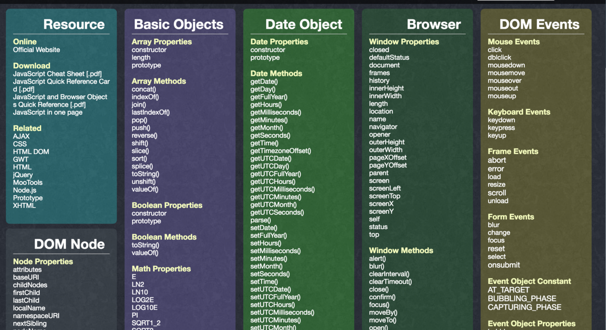
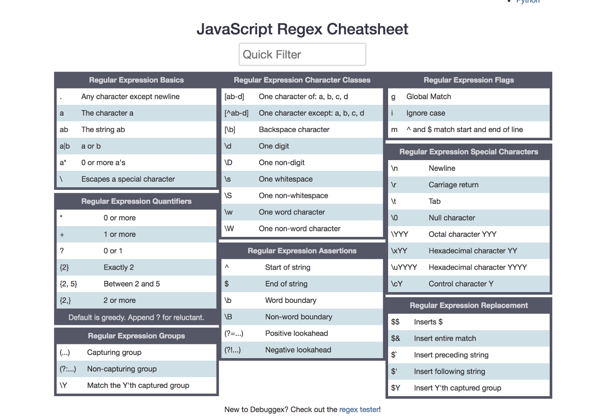
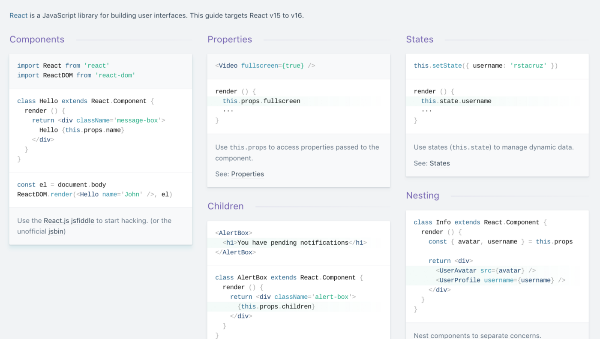
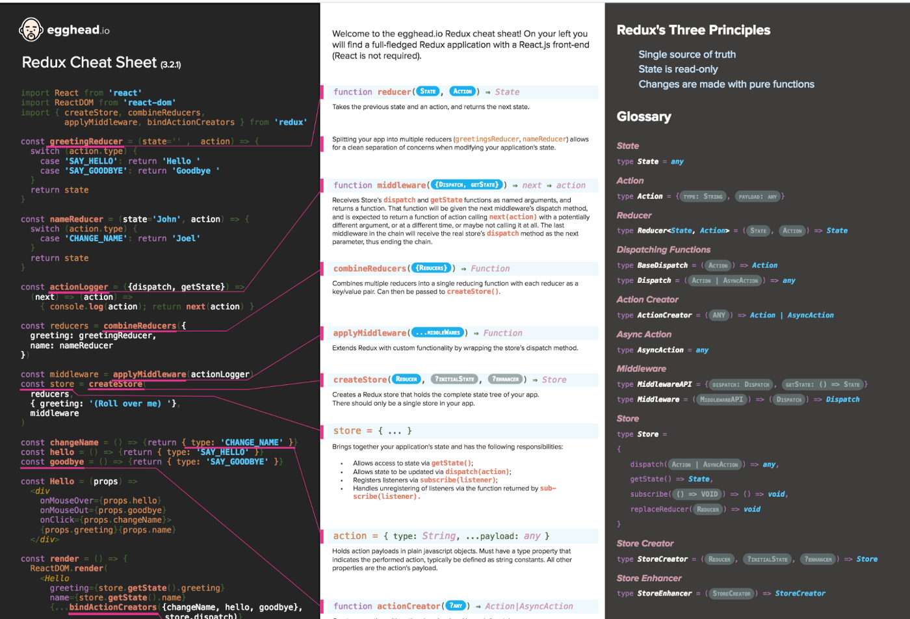
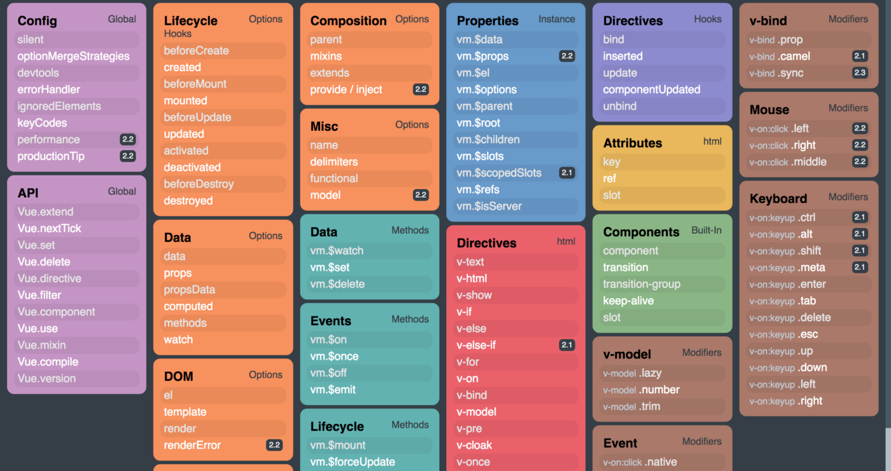
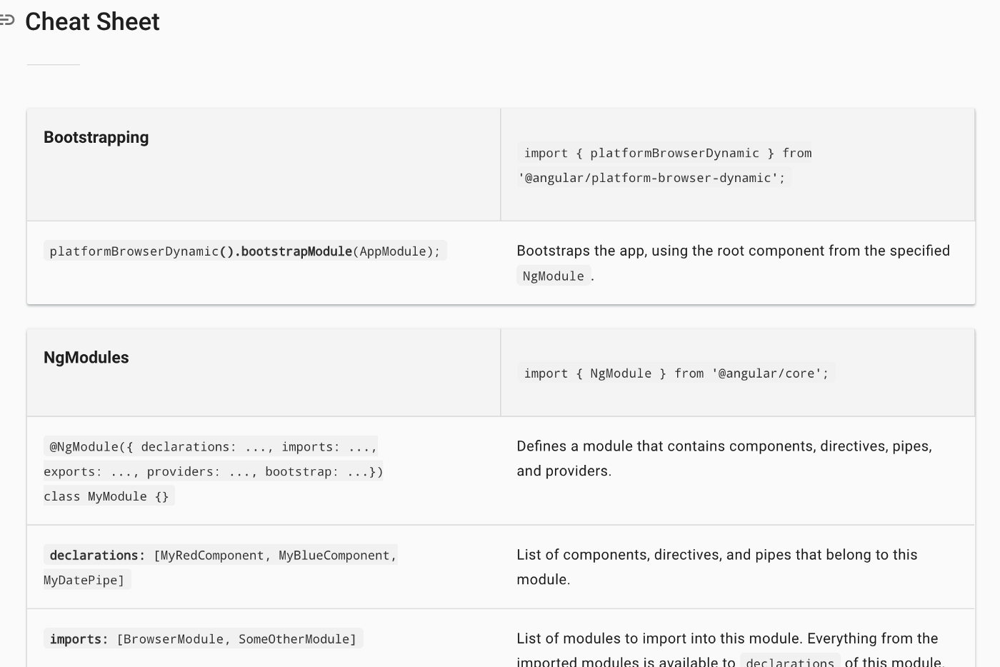
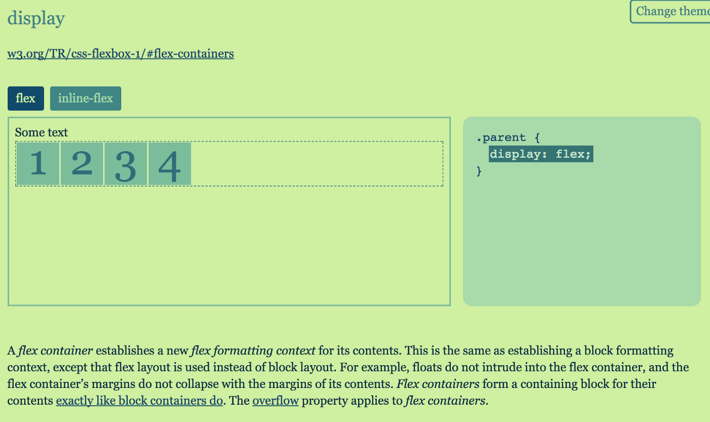
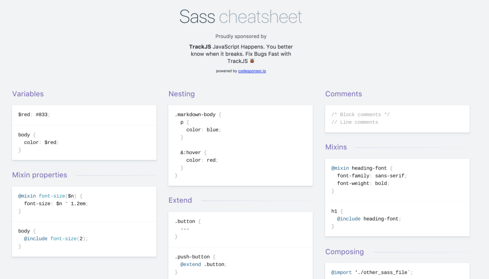
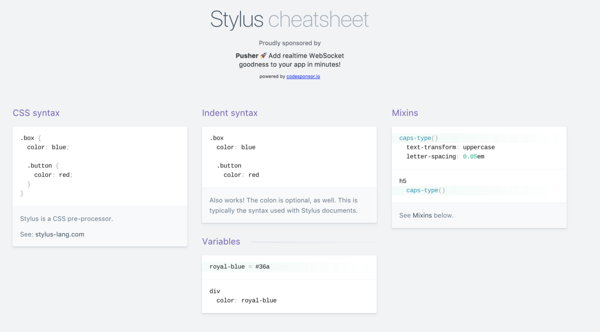
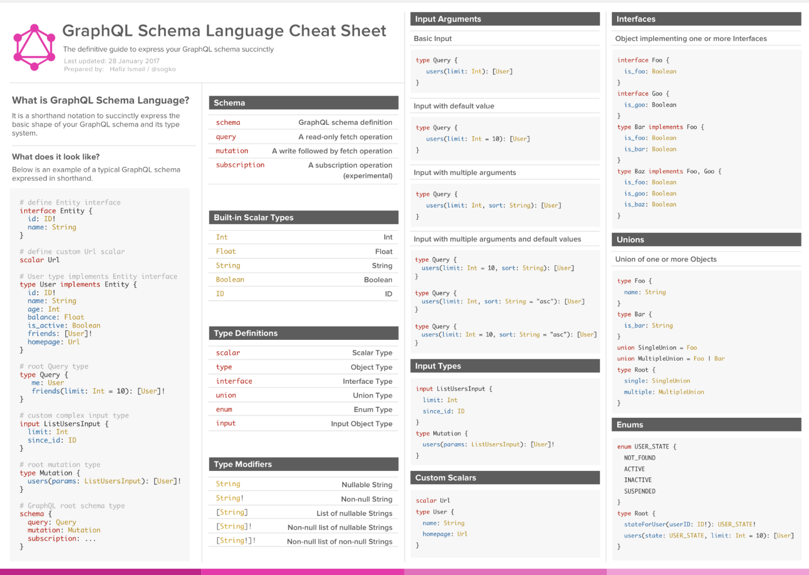

# 非常有用的前端知识备忘录 - All in One

> 完全了解所有API几乎是不可能的。 这是本篇备忘存在的原因！ 

- [ES6](#ES6)
- [JavaScript](#JavaScript)
- [JavaScript 正则表达式](#JavaScript正则表达式)
- [React](#React)
- [Redux](#Redux)
- [Vue.js](#Vue.js)
- [Vuex](#Vuex)
- [Angular](#Angular)
- [Flexbox](#Flexbox)
- [SCSS](#SCSS)
- [Stylus](#Stylus)
- [GraphQL](#GraphQL)

## ES6

[https://devhints.io/es6](https://devhints.io/es6)

## JavaScript

[http://overapi.com/javascript](http://overapi.com/javascript)

## JavaScript正则表达式

[https://www.debuggex.com/cheatsheet/regex/javascript](https://www.debuggex.com/cheatsheet/regex/javascript)

## React

[https://devhints.io/react](https://devhints.io/react)

## Redux

[https://github.com/linkmesrl/react-journey-2016/blob/master/resources/egghead-redux-cheat-sheet-3-2-1.pdf](https://github.com/linkmesrl/react-journey-2016/blob/master/resources/egghead-redux-cheat-sheet-3-2-1.pdf)

## Vue.js

[https://vuejs-tips.github.io/cheatsheet/](https://vuejs-tips.github.io/cheatsheet/)

## Vuex

[https://vuejs-tips.github.io/vuex-cheatsheet/](https://vuejs-tips.github.io/vuex-cheatsheet/)

## Angular

[https://angular.io/guide/cheatsheet](https://angular.io/guide/cheatsheet)

## Flexbox

[https://yoksel.github.io/flex-cheatsheet/](https://yoksel.github.io/flex-cheatsheet/)

## SCSS

[https://devhints.io/sass](https://devhints.io/sass)

## Stylus

[https://devhints.io/stylus](https://devhints.io/stylus)

## GraphQL

[https://raw.githubusercontent.com/sogko/graphql-shorthand-notation-cheat-sheet/master/graphql-shorthand-notation-cheat-sheet.png](https://raw.githubusercontent.com/sogko/graphql-shorthand-notation-cheat-sheet/master/graphql-shorthand-notation-cheat-sheet.png)

### 缺少您最喜欢的备忘单吗？ 请在评论中让留言，我将补充进来！

https://rxviz.com/examples/chess-game