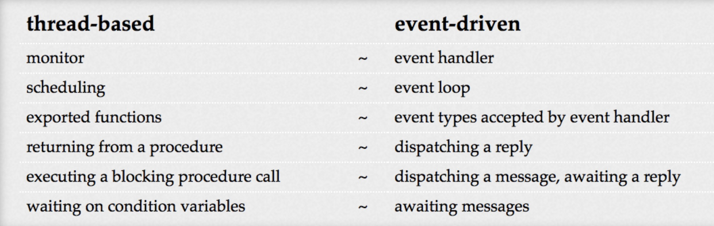

# 「译文」可扩展Web架构的并行编程 -- 基于线程的编程 VS 基于事件驱动的编程

> 原文作者：Benjamin Erb

> 原文地址：http://berb.github.io/diploma-thesis/original/043_threadsevents.html#43

我们为服务器概述了一组特殊要求，例如无状态。这不仅简化了实际的实现，而且在某种程度上使我们对线程与事件的考虑产生了偏差。在第5章中，我们将从更一般的角度关注并发编程。在本章的其余部分中，我们将花一些时间仔细研究线程与事件的一般参数。讨论是一个非常古老的讨论，早在操作系统领域就出现了。但是，高性能网络服务器始终是一个具有挑战性的主题，在这种情况下，该论点已被反复重复几次。

我们介绍了劳厄和李约瑟的二重性论点，它解释了线程和事件之间的内在联系。然后，我们回顾一些较新的出版物，将两种模型进行比较或为其中一种进行竞选，通常同时将另一种模型涂成黑色。最后，我们对这两种模型都持中立看法，并总结其优缺点。

## 对偶论证

在70年代后期，Laurer和Needham [Lau79]从流程，同步和通信的角度对操作系统设计的两个主要编程模型进行了广泛研究。 更准确地说，他们将面向消息的系统与面向过程的系统进行了比较。 前者使用少量使用显式消息传递的进程，而后者基于大量使用共享数据的小型进程。 因此，面向消息的系统类似于事件驱动的系统，而面向过程的系统则对应于基于线程的系统[vB03a，Li07]。 他们的主要贡献是三个重要的观察：

1. 两种型号都是彼此对偶的。 可以将用一个模型编写的程序直接映射到基于另一个模型的等效程序。
2. 这两种模型在逻辑上都是等效的，尽管它们使用不同的概念并提供了不同的语法。
3. 假设使用相同的调度策略，则在两个模型中编写的程序的性能基本相同。

因此，Laurer和Needham提出了两个模型的映射，从而可以面对这两个概念的构建块。 表4.3中显示了最重要的映射。

*表4.3：基于Lauer和Needham [Lau79]的基于线程和事件驱动的概念的映射，经过调整和重编以类似于事件驱动系统[vB03a，Li07]。*

使用其中一个模型的应用程序中的控制流会生成一个唯一的图，其中包含某些屈服或阻塞节点（例如，等待回复或过程返回）。此类节点之间的边表示遍历图形时执行的代码。根据对偶论据，当实现等效逻辑并且因此程序是对偶时，基于线程的程序和基于事件驱动的程序都产生相同的阻塞点。冯·贝伦（Von Behren）将此图表示形式称为阻塞图[vB03a]。

Lauer和Needham认为，通过替换概念并将程序从一种模型转换为另一种模型，逻辑不会受到影响，因此代码的语义内容是不变的。结果，他们声称，在适当的执行环境下，两个概念模型都是等效的，甚至两个模型的性能都相同。结果，他们建议正确的模型选择取决于实际应用，并且一般而言，这两种模型都不可取。

尽管公认的一般概念是可比的[vB03a，Li07]，但对于映射也有一些批评，尤其是当将其应用于混合了其他编程概念的基于事件的系统时。 Von Behren [vB03a]指出Lauer和Needham忽略了基于事件的系统的协作调度，这是当今许多事件驱动系统的重要组成部分。 Lauer和Needham还禁止在其映射中使用任何类型的共享内存或全局数据。但是，许多事件驱动系统确实在少数地方使用共享内存。

尽管有这些说明，但对偶论证通常使我们可以从固有性能特征方面放松对这两个系统的考虑。实际上，我们可以根据应用程序的实际需求专注于两种模型的适用性和适用性。此外，关于性能和可伸缩性，对偶论证促使我们质疑模型的实现，而不是模型本身。

接下来，我们来看看针对一种模型或另一种模型的一些流行诉求，以及对每种模型的普遍批评的汇编。

## 线程`Threads`的情况

支持线程的人认为，在大多数编程语言中，线程是占主导地位的顺序编程风格的自然扩展，用于提供并发[vB03a，vB03b，Gus05]。从开发人员的角度来看，线程映射要与关联的控制流一起执行的工作。更准确地说，线程从任务本身的角度表示工作。这样可以开发并发代码，同时专注于完成任务所需的顺序操作步骤。透明地执行阻塞操作和I / O调用使开发人员不必担心底层的调度细节。相反，他可以依赖操作系统和运行时环境。

线程是操作系统的众所周知和理解的实体，并且是用于任何种类的并行性的通用原语。线程对于利用真正的CPU并发性也是必不可少的。因此，即使其他并发方法也依赖于基于线程的底层实现，尽管它们对开发人员隐藏了此特征。

当任务大多是孤立的并且仅共享有限数量的状态时（参见多线程Web服务器），线程提供的抽象看起来很简单，并且功能特别强大。线程还在语法方面为并发应用程序提供了坚实的结构化原语。

基于线程的系统的反对者提出了一些缺点。对于Ousterhout来说，他可能发表了最著名的针对线程的言论[Ous96]，即使对编程专家来说，开发正确的并发代码也极其困难，这是线程最有害的特性。一旦多线程系统在多个线程之间共享一个状态，就必须进行协调和同步。协调和同步需要锁定原语，这又带来了其他问题。错误的锁定会引入死锁或活锁，并威胁到应用程序的生命力。选择正确的锁定粒度也是麻烦的根源。太粗的锁会减慢并发代码的速度，并导致降级的顺序执行。相反，太细的锁会增加死锁/活锁的危险，并增加锁的开销。基于线程和锁的并发组件不可组合。给定两个不同的线程安全组件，它们的组合本身就不是线程安全的。例如，在不知不觉中在多线程组件之间放置循环依赖关系可能会导致严重的死锁。

Lee [Lee06]专注于由于不确定性和抢先式调度而导致的多线程代码缺乏可理解性和可预测性。多线程似乎容易出错，并且很难调试。由于多个线程的所有可能的交织而导致的状态爆炸实际上使得不可能对并发代码进行合理的执行分析。这主要是由于抢先调度的不可预测性造成的。因此，与von Behren [vB03a]相反，Lee认为线程并不是并发执行流的良好抽象。恰恰相反，过度简化的线程抽象似乎令人误解，因为它假装连续执行可能与任何实际运行时行为都不匹配的代码。

关于性能，我们已经知道广泛的上下文切换的缺点。同样，大量线程由于线程堆栈而需要大量内存。使用锁会产生额外的开销。

作为回报，亲线程阵营认为，提到的几个缺点实际上是不良的线程库实现和抢先式调度的本质的结果。

## 事件`events`的情况

与基于线程的系统相比，像Ousterhout [Ous96]这样的事件的活动家将事件驱动的系统视为高并发服务器的更合适基础。单线程事件循环的基本思想通过提供简单而直接的并行模型来减轻并发问题。

通过不使用阻塞/同步I / O，尽管使用了单个线程，但多个I / O操作重叠。这样可以实现I / O并行，而无需同时要求CPU并行。这产生了多线程并发的错觉，因为多个概念执行流似乎同时发生（至少它们的I / O操作会发生）。可以开发事件处理程序代码和回调，而不必担心立即并发访问状态。只要在回调中未触发任何让步操作，就可以保证回调的执行是确定性的。这提供了确定性推理的感觉。调度成为一项显式操作，发生在应用程序内部。可以对计划进行细粒度的调整，并且可以考虑到特定于应用程序的要求。

使用事件和事件处理程序会产生异步行为，某些开发人员喜欢这种行为。异步样式没有提供隔离的顺序执行流的抽象，而是使I / O操作与CPU绑定操作之间的区别显而易见。

但是，对于事件驱动系统也存在严重的担忧。拒绝事件驱动系统的最常见原因是其编程风格。事件循环和注册的事件处理程序的思想产生了控制的反转。代替顺序操作，代码被组织为一组零散的事件处理程序和回调。在非平凡的应用程序中，这会导致大量的回调链接。 Gustafsson将事件循环的概念称为“延迟的GOTO” [Gus05]，顺序对事件执行回调。与提供更高抽象性的线程相比，事件驱动的系统因此向后退一步。

现有的顺序算法不能直接在事件驱动的系统中使用。相反，无论何时触发I / O操作，都必须将代码拆分并移到不同的回调中，从而创建大型级联的回调链。

模糊的控制流通常伴随着屈服之前和恢复之后的状态的保存和恢复的必要性。当使用命令式，低级编程语言而不支持缓解语言习惯用法（如闭包）时，这一点尤其明显。线程可以将状态存储为线程堆栈的一部分，而与任何调度无关。在事件驱动的系统中，开发人员有责任处理和恢复事件处理程序之间的状态。

尽管线程受到死锁或活锁的威胁，但单线程，事件驱动的应用程序可能会被长时间运行的，受CPU约束的回调，阻塞操作或拒绝屈服的回调破坏。

尽管单线程事件循环模型适合大多数I / O绑定的应用程序，但是默认情况下很难利用真正的CPU并发性并利用多个内核（请参阅：autoref：TP 4.2.2小节）。

## 不同概念的融合

关于线程还是事件的另一种实质论据是Adya等人提出的。 [Ady02]。 讨论基于线程和基于事件的编程风格后，他们得出了不同的管理概念，这些编程风格可用于并发。 但是，他们认为这些概念经常被混淆，并且也与实际的编程样式相混淆。 Adya等。 指出这使得很难为并行编程找到合适的方法。 概念的分离产生了五个不同的概念，其中大多数彼此正交。

### 任务管理

程序中的执行流通常分为共存的单独任务。管理这些任务的并发执行需要一个管理概念，即如何像调度一样在任务之间进行切换。串行任务管理按顺序运行要完成的任务，然后切换到下一个任务。尽管此策略防止了由于隔离执行而导致的状态冲突，但它不允许利用真正的并行性。同样，长时间运行的任务或等待I / O的任务也会延迟其他未决任务的执行。抢占式任务管理可同时使多个任务重叠执行，并利用多个内核。但是，任务将在外部进行调度，因此任务不了解任务管理。

一个有趣的替代方法是协作任务管理，保留了两个模型的某些优点。任务可以协同且明确地产生，但仍使推理代码变得更加容易。单线程协作任务管理有助于处理不变性和状态。对于多线程代码，协作任务管理通常会减少上下文切换的数量。

### `stack` 堆栈管理

另一个概念支配着执行流与相关状态之间的关系。在基于线程的模型中，任务具有自己的堆栈，因此（自动）堆栈管理是其固有功能。基于事件的系统需要对任务堆栈进行不同的处理。由于在这种情况下逻辑任务的执行流程由一系列分派的事件和事件处理程序的相应执行来表示，因此没有直接的堆栈概念。此外，不同的过程处理与逻辑任务相对应的事件顺序，因此必须在多个事件处理程序之间中断状态处理。因此，开发人员必须明确提供堆栈。 Adya等。将此职责称为堆栈撕裂。在屈服之前，必须对任务堆栈进行序列化和存储。当事件处理程序以后继续执行时，它必须首先加载并重建相应任务的堆栈。

一些功能语言（例如Scheme）为此提供了语言习语，例如闭包或继续。闭包是封装其引用环境（即“堆栈”）的函数。 Continuation是用于封装控制状态的特殊闭包。大多数低级语言（例如C）都不支持这些功能机制，因此堆栈剥离仍然是强制性的解决方法。

### `I/O` 管理

I / O管理负责I / O操作，并且可以分为同步和异步管理接口。 我们已经在本章前面详细讨论了这两个概念。 但是，重要的是要注意I / O管理和任务管理是正交的概念。 尽管计算操作可以在任务之间共享状态，但对于I / O通常不是这样。 因此，可以同时执行I / O操作的任务重叠。 此外，每个任务管理概念都可以与同步或异步I / O管理概念一起使用。

### 冲突管理

不同的任务管理概念针对操作的原子性提供了特定的协议。 这对于在任务之间共享状态时保证数据的一致性非常重要。 串行和某种程度上（即单线程）的协作任务管理概念提供了一种非常简单的冲突管理形式。 串行任务是专门执行的，合作任务在所有产生操作之间提供原子语义。 这使得对不变量进行推理非常容易。 对于先占式任务管理，确保不变式保持更为复杂，并且需要同步机制。

### 数据分割

我们已经看到，共享状态和一致性的保持与任务和冲突管理相关。 结果，对数据进行分区并限制访问状态可能会减少冲突的可能性。 例如，线程本地状态不必共享，可以显式分区。

### 寻找最佳spot

Adya等。 提出分离管理概念的目的，以针对最方便的并发编程形式进行辩论，除了粗暴的线程与事件辩论[Ady02]。 他们特别注意前两个管理原则。 传统的基于事件的系统主要基于协作任务管理和需要堆栈撕裂的手动堆栈管理，而基于线程的系统通常使用抢占式任务管理和自动堆栈管理。 最终，他们倾向于使用协作任务管理，但使开发人员摆脱堆栈管理负担的模型，如图4.5所示。 这样的模型简化了并发反射，需要最少的冲突管理，并且与两个I / O管理模型保持一致。

*图4.5：根据Adya等人的观点，通过使用协作式任务管理和自动堆栈管理，任务管理和堆栈管理的最有效点。 [Ady02]。*

一些最新的事件驱动系统（例如node.js）非常接近此预期模型。 他们将闭包作为语言原语，将堆栈数据封装到回调函数中，从而减轻了堆栈剥离的工作量。

古斯塔夫森[Gus05]得到了类似的结果。 导致线程使用麻烦的不是线程的本质，而是抢先式调度。 线程的协同调度减轻了线程的痛苦。 非抢占式调度使我们无需大量锁定即可保留不变式。 Gustafsson还通过指出线程或事件问题与协作式或抢先式调度问题正交来支持Adya。

## 结论

在我们评估不同模型之前，让我们重述我们最初的问题。我们正在寻找适用于高并发和高性能网络服务器（在我们的情况下为Web服务器）的编程模型。

我们对基于线程的方法和事件驱动的方法进行了详细的研究。我们还了解了SEDA之类的混合方法，以及高度优化的线程库，这些库采用了针对线程堆栈大小和自适应调度的编译器优化。我们已经看到，可以对使用不同方法的各种服务器进行调整和优化，以至少提供大致类似的性能。

但是，对于大规模连接并发，使用异步/非阻塞I / O操作的事件驱动服务器体系结构似乎更受欢迎，因为它们在重并发情况下提供了更好的可伸缩性。这样的服务器即使需要处理数千个并发连接，也需要更少的内存。而且，它们不需要专门的线程库。另一方面，即使对于高度并发的服务器实现，成熟的线程实现（例如本机POSIX线程库[Mol03]）仍可提供合理的性能。

关于赞成线程阵营和赞成事件阵营之间的永恒论点，我们已经看到，两种编程模型实际上都是彼此对偶的，并且可以在某些限制下进行转换。因此，使用任一模型的服务器的实际性能在很大程度上取决于在其上执行的实际环境，包括操作系统和硬件功能。由于对偶性参数可以追溯到异步，无阻塞I / O操作的时间，因此多核CPU尚不可用，因此不能低估环境的影响。

接下来，我们了解了线程和事件的本质，意识到在讨论这两种模型时，通常会混淆不同的管理概念。主要是协作调度性质使事件驱动的系统对于高度并发的服务器如此有趣。许多低级事件驱动系统的缺点是需要进行堆栈抓取，因为线程堆栈框架封装了状态，因此对于线程来说这不是必需的概念。如今，功能性和多范式语言减轻了诸如闭包之类的语言习语带来的堆栈撕裂问题。尽管与线程的顺序结构相比，这仍然有很大的不同，但是这在事件驱动的系统中允许使用更加体面的编程样式。
