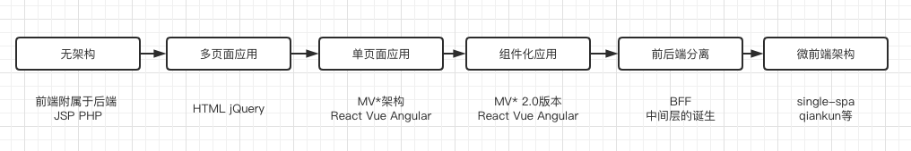

微前端是每一位高级前端工程师都应该了解的解决方案。笔者将理论、应用与实践相结合，将开发与生产相结合，旨在减少小伙伴儿们采坑微前端遇到的困难。
强烈推荐未实践过的同学跟着本文的`Demo`动手写一遍，以加深理解和记忆。

## 背景介绍

近几年，前端技术飞速发展，达到了前所未有的繁荣景象，前端生态生机勃勃。与此同时，前端架构也发生了巨大的改变。

从无架构到多页面，从多页面到单页面，从单页面到组件化，从组件化到前后端分离，再到今天的微前端。



每一次改变都是为了更好地解决问题。今天，微前端的出现也不例外，当今大型的前端项目主要会存在以下问题：

- 中心化严重：项目过于庞大，所有功能都集中在一起，项目越来越庞大。
- 低内聚，高耦合：由于功能过于繁多和复杂，相互依赖严重，严重耦合。

## 1 微前端介绍

*想跳过理论知识的同学可以直接从 `DEMO` 部分开始*

### 1.1 什么是微前端？

[微前端](https://micro-frontends.org/)是一种多个团队通过独立发布功能的方式，来共同构建现代化 `web` 应用的技术手段及方法策略。

一般由**一个主应用**及**一个或多个子应用**组成。

### 1.2微前端的核心价值？

#### 1.2.1 与技术栈无关

所有应用均可选择不同技术栈，无需为选定哪个技术栈而困扰

#### 1.2.2 可以独立开发、独立部署

微应用之间相互独立，均可独立开发、独立部署，部署完成后主应用自动完成同步更新

#### 1.2.3 可以增量更新

在面对各种复杂场景时，我们通常很难对一个已经存在的系统做全量的技术栈升级或重构，而微前端是一种非常好的实施渐进式重构（部署更新）的手段和策略

#### 1.2.4 具备独立运行时

每个微应用之间状态隔离，运行时状态不共享

### 1.3 微前端的架构模式

#### 1.3.1 基座模式

通过一个主应用来管理其它应用。设计难度小，方便实践，但是，通用度较低。

#### 1.3.2 自组织模式

应用之间是平等的，不存在相互管理的模式。设计难度大，不方便实施，但是通用性较高。

### 1.4 什么是 [qiankun](https://qiankun.umijs.org/) ?

`qiankun` 是一个基于 `single-spa` 的微前端实现库，旨在帮助大家能更简单、无痛的构建一个生产可用微前端架构系统。

`qiankun` 孵化自蚂蚁金融科技基于微前端架构的云产品统一接入平台，在经过一批线上应用的充分检验及打磨后，我们将其微前端内核抽取出来并开源，希望能同时帮助社区有类似需求的系统更方便的构建自己的微前端系统，同时也希望通过社区的帮助将 `qiankun` 打磨的更加成熟完善。

目前 `qiankun` 已在蚂蚁内部服务了超过 200+ 线上应用，在易用性及完备性上，绝对是值得信赖的。

> 以上介绍来自 qiankun 官网

### 1.5`qiankun` 的特性：

1. 基于 single-spa 封装，提供了更加开箱即用的 API。
2. 技术栈无关，任意技术栈的应用均可 使用/接入，不论是 React/Vue/Angular/JQuery 还是其他等框架。
3. HTML Entry 接入方式，让你接入微应用像使用 iframe 一样简单。
4. 样式隔离，确保微应用之间样式互相不干扰。
5. JS 沙箱，确保微应用之间 全局变量/事件 不冲突。
6. 资源预加载，在浏览器空闲时间预加载未打开的微应用资源，加速微应用打开速度。

### 1.6 为什么不是`single-spa`？

既然`qiankun`基于`single-spa`，那我们为什么不选择更接近底层的`single-spa`来开发？

答案是：**青，取之于蓝而青于蓝**。

`qiankun`基于`single-spa`二次开发，实现了更多功能（如：`html entry`），并且解决了很多问题（如：`JS`隔离、样式隔离等）。带来更好的开发及用户体验（预加载等）。

### 1.7 为什么不是 `iframe`?

`iframe`是浏览器提供的原生应用隔离解决方案，由于隔离性太强，导致有以下几个问题：

1. 开发体验：开发时难以解决`iframe`之间通信以及样式问题，开发难度大。
2. 用户体验：慢，并且`url` 不同步。浏览器刷新 `iframe url` 状态丢失、后退前进按钮无法使用。

详情看这里 [Why Not Iframe](https://www.yuque.com/kuitos/gky7yw/gesexv)


## 2 应用场景

- 历史项目维护和迭代（如用`angular.js 即angular 1.xx版本`，开发的项目）
- 巨石应用（项目过于庞大）
- 跨技术开发（希望用不同的技术栈开发）
- 技术调研及储备（希望实践前沿技术）

## 3 `qiankun` vs `single-spa` vs `iframe`

解决方案 | 独立开发 | 独立部署 | 样式隔离 | JS 隔离 | Entry 形式 | 易用性 | 技术栈 |
-- | -- | -- | -- | -- | -- |  -- | -- |  -- |
qiankun | ✅ | ✅ | ✅ | ✅ | .html | 好 | 不限 |
single-spa | ✅ | ✅ | ❌ | ❌ | .js | 一般 | 不限 |
iframe | ✅ | ✅ | ✅ | ✅ | .html | 好 | 不限 |

### 3.1 `JS Entry` vs `HTML Entry`

> `entry` 指子应用提供资源的入口形式

`JS Entry` 的方式通常是子应用将资源打成一个 `entry script`，比如 `single-spa` 的 `example` 中的方式。但这个方案的限制也很多，如要求子应用的所有资源打包到一个 `js bundle` 里，包括 `css`、图片等资源。除了打出来的包可能体积庞大之外的问题之外，资源的并行加载等特性也无法利用上。

`HTML Entry` 则更加灵活，直接将子应用打出来 `HTML` 作为入口，主框架可以通过 `fetch html` 的方式获取子应用的静态资源，同时将 `HTML document` 作为子节点塞到主框架的容器中。这样不仅可以极大的减少主应用的接入成本，子应用的开发方式及打包方式基本上也不需要调整，而且可以天然的解决子应用之间样式隔离的问题。

## 4 实践`qiankun` 

### 先看效果图


### 主应用开发

主应用可以使用 `HTML5 Vue React Angular` 进行开发，笔者使用 `Vue` 来开发主应用。

#### 1安装 `qiankun`

```sh
yarn add qiankun
```

#### 2注册子应用

**注意：** `entry` 是加载子应用的入口，必须和子项目保持一致；
子项目必须支持跨域请求。

*main.js*

```js
import Vue from 'vue'
import App from './App.vue'
import router from './router'

// 引入 qiankun 包
import { registerMicroApps, start } from 'qiankun'
// 子应用列表
const apps = [
  {
    name: 'reactApp', // 子应用的名字，随便起
    entry: '//localhost:7100', // 默认会加载这个入口的index.html，（子应用必须支持跨域）fetch
    container: '#reactApp', // 容器名（用于挂载子应用的dom 元素id)，必须与主应用中自定义dom元素的标识相同（推荐使用id)
    activeRule: '/react', // 子应用激活的规则（会根据路由进行匹配）
  },
  {
    name: 'vueApp', // 子应用的名字，随便起
    entry: '//localhost:7101', // 默认会加载这个index.html 解析里面的js 动态的执行 （子应用必须支持跨域）fetch
    container: '#vueApp', // 容器名（用于挂载子应用的dom 元素id)，必须与主应用中自定义dom元素的标识相同（推荐使用id)
    activeRule: '/vue', // 子应用激活的规则（会根据路由进行匹配）
    props: { a: 1 } // 传递给子应用的数据
  },
  {
    name: 'onlineApp', // app name registered
    entry: '//cicd.alexshan.com/index.html', // 默认会加载这个html 解析里面的js 动态的执行 （子应用必须支持跨域）fetch
    container: '#onlineApp', // 容器名
    activeRule: '/online' // 激活的路径
  }
]

// 注册应用
registerMicroApps(apps) 

// 开启
start()

new Vue({
  router,
  render: h => h(App),
}).$mount('#app')
```

#### 3创建挂载子应用的容器

可以根据使用场景，选择在不同的页面，添加挂载子应用的容器

*App.vue*

```js
<template>
  <div id="app">
    
    <el-menu :router="true" mode="horizontal">
      <!--基座中可以放自己的路由-->
      <el-menu-item index="/">Home</el-menu-item>
      
      <!--引用其他子应用-->
      <el-menu-item index="/vue">vue应用</el-menu-item>
      <el-menu-item index="/react">react应用</el-menu-item>
      <el-menu-item index="/online">react online 应用</el-menu-item>
    </el-menu>
    
    <router-view></router-view>
    
    <!-- 下面的两个容器用于挂载子应用 不能删除 -->
    <div id="vueApp"></div>
    <div id="reactApp"></div>
    <div id="onlineApp"></div>
  </div>
</template>

<script>
export default {
  name: "App",
  components: {},
};
</script>
```

主应用完整代码：[https://github.com/AlexShan2008/micro-fe-base](https://github.com/AlexShan2008/micro-fe-base)

### 子应用开发之 React

> 无需安装 `qiankun` 相关依赖，只需按约定导出生命周期函数即可

#### 1子应用入口文件导出生命周期函数

*index.js*

```js
import React from 'react';
import ReactDOM from 'react-dom';
import './index.css';
import App from './App';

function render(){
  ReactDOM.render(
    <React.StrictMode>
      <App />
    </React.StrictMode>,
    document.getElementById('root')
  );
}

// __POWERED_BY_QIANKUN__ 是 qiankun 应用的全局变量
if(!window.__POWERED_BY_QIANKUN__){
  render();
}

export async function bootstrap(){
}
export async function mount() {
  render()
}
export async function unmount(){
  ReactDOM.unmountComponentAtNode( document.getElementById('root'));
}
```

#### 2设置跨域许可，更改`webpack`配置文件

> 如果是通过 `create-react-app` 工具构建的项目，需要安装依赖重写配置

2.1 安装依赖 `react-app-rewired`

```sh
yarn add react-app-rewired -D
```

2.2 重新配置项目启动脚本

*1 package.json*

```json
  "scripts": {
    "start": "react-app-rewired start",
    "build": "react-app-rewired build",
    "test": "react-app-rewired test",
    "eject": "react-app-rewired eject"
  }
```

2.3 项目根目录下创建配置文件 `config-overrides.js`

*2 config-overrides.js* 

```js
module.exports = {
    webpack:(config)=>{
        config.output.library = 'reactApp';
        config.output.libraryTarget = 'umd';
        config.output.publicPath = 'http://localhost:7100/';
        return config;
    },
    devServer:(configFunction)=>{
        return function (proxy,allowedHost){
            const config = configFunction(proxy,allowedHost);
            config.headers = {
                "Access-Control-Allow-Origin":'*'
            }
            return config
        }
    }
}
```

#### 路由配置

> 通过全局变量 window.__POWERED_BY_QIANKUN__ 来判断base 路径

*App.js*

```js
import React, { lazy, Suspense } from 'react';
import { BrowserRouter as Router, Link, Route, Switch } from 'react-router-dom';
import 'antd/dist/antd.min.css';
import './App.css';
import Home from './pages/Home';

const About = lazy(() => import('./pages/About'));

const RouteExample = () => {
  return (
    // basename 必须与基座 base 保持一致 TODO: 可以封装一个组件来统一解决这个问题
    <Router basename={window.__POWERED_BY_QIANKUN__ ? '/react' : '/'}>
      <nav>
        <Link to="/">Home</Link>
        <Divider type="vertical" />
        <Link to="/about">About</Link>
      </nav>
      <Suspense fallback={null}>
        <Switch>
          <Route path="/" exact component={Home} />
          <Route path="/about" component={About} />
        </Switch>
      </Suspense>
    </Router>
  );
};
export default function App() {
  return (
    <div className="app-main">
    </div>
  );
}
```

`react` 子应用完整代码：[https://github.com/AlexShan2008/micro-fe-react](https://github.com/AlexShan2008/micro-fe-react)

### 子应用开发之 Vue

#### 1子应用入口文件导出生命周期函数

*main.js*

```js
/**
 * bootstrap 函数只会在初始化时执行一次
 * 第二次进入子应用，会直接挂载子应用，并不会触发启动函数 bootstrap
 * 通常可以做一些全局变量初始化工作
 * 应用级别的缓存在卸载阶段不会被销毁
 */
export async function bootstrap() {
  console.log('react app bootstraped');
}
/**
 * The mount method is called every time the application enters,
 * usually we trigger the application's rendering method here.
 */
export async function mount(props) {
  console.log(props);
  ReactDOM.render(<App />, document.getElementById('react15Root'));
}
/**
 * Methods that are called each time the application is switched/unloaded,
 * usually in this case we uninstall the application instance of the subapplication.
 */
export async function unmount() {
  ReactDOM.unmountComponentAtNode(document.getElementById('react15Root'));
}
```

#### 2根据子项目的访问来源，执行不同渲染

> 解决子项目开发和部署时不能独立访问的问题

*main.js*

```js
let router = null;
let instance = null;
// 渲染函数
function render(props = {}) {
  const { container } = props;
  router = new VueRouter({
    base: window.__POWERED_BY_QIANKUN__ ? '/vue' : '/', // 这个路径 '/vue' 和主应用 activeRule 相同
    mode: 'history',
  });
  instance = new Vue({
    router,
    render: h => h(App),
  }).$mount(container ? container.querySelector('#app') : '#app');
}

// qiankun 渲染的全局变量 __POWERED_BY_QIANKUN__
if (!window.__POWERED_BY_QIANKUN__) {
  render();
}
```

#### 3配置 `webpack public path`

> 解决基础路径不正确的问题

*main.js*
```js
// 动态添加 publicPath
if (window.__POWERED_BY_QIANKUN__) {
  // eslint-disable-next-line no-undef
  __webpack_public_path__ = window.__INJECTED_PUBLIC_PATH_BY_QIANKUN__; // 固定用法
}
```
*完整的main.js*
```js
import Vue from 'vue'
import VueRouter from 'vue-router';
import App from './App.vue'
Vue.config.productionTip = false
let router = null;
let instance = null;
function render(props = {}) {
  const { container } = props;
  router = new VueRouter({
    base: window.__POWERED_BY_QIANKUN__ ? '/vue' : '/', // path 需要和基座（base）应用保持一致
    mode: 'history'
  });
  instance = new Vue({
    router,
    render: h => h(App),
  }).$mount(container ? container.querySelector('#app') : '#app');
}
// 解决子项目不能独立访问的问题 根据访问来源，执行不同渲染方法
if (!window.__POWERED_BY_QIANKUN__) {
  render();
}
// 解决基础路径不正确的问题
if (window.__POWERED_BY_QIANKUN__) { // 动态添加publicPath
  // eslint-disable-next-line no-undef
  __webpack_public_path__ = window.__INJECTED_PUBLIC_PATH_BY_QIANKUN__;
}
// 启动
export async function bootstrap() {
  console.log('[vue] vue app bootstraped');
}
// 挂载
export async function mount(props) {
  console.log('[vue] props from main framework', props);
  render(props);
}
// 卸载
export async function unmount() {
  instance.$destroy();
  instance.$el.innerHTML = '';
  instance = null;
  router = null;
}
```

### 更改子应用配置：开发、构建及打包

*vue.config.js*

```js
const path = require('path');
const { name } = require('./package');
function resolve(dir) {
  return path.join(__dirname, dir);
}
const port = 7101; // dev port 必须和基座（主应用）的entry 入口保持一致
module.exports = {
  outputDir: 'dist',
  assetsDir: 'static',
  filenameHashing: true,
  devServer: {
    hot: true,
    disableHostCheck: true,
    port,
    overlay: {
      warnings: false,
      errors: true,
    },
    headers: {
      'Access-Control-Allow-Origin': '*', // 允许开发时跨域获取资源
    },
  },
  // 自定义webpack配置
  configureWebpack: {
    resolve: {
      alias: {
        '@': resolve('src'),
      },
    },
    output: {
      // 把子应用打包成 umd 库格式
      library: `${name}-[name]`,
      libraryTarget: 'umd',
      jsonpFunction: `webpackJsonp_${name}`,
    },
  },
};
```

`vue` 子应用完整代码：[https://github.com/AlexShan2008/micro-fe-vue](https://github.com/AlexShan2008/micro-fe-vue)

### 子应用 React (生产环境）

将 `react` 子应用按普通打包构建即可，与普通开发无差异。

## 5 项目部署

所有项目可以独立部署，由于各项目打包以后均是静态页面，我们采用 `nginx` 来部署项目。

### nginx 配置

- 跨域许可
- `index.html` 页面重定向

*nginx.conf*

1. 解决跨域许可，在轻请求头添加跨域许可

```sh
http {
    server {
        location / {
            add_header 'Access-Control-Allow-Origin' '*'; # 建议根据域名进行许可
            add_header 'Access-Control-Allow-Credentials' 'true';
            add_header 'Access-Control-Allow-Methods' 'GET, POST, OPTIONS';
            add_header 'Access-Control-Allow-Headers' 'DNT,X-CustomHeader,Keep-Alive,User-Agent,X-Requested-With,If-Modified-Since,Cache-Control,Content-Type';
        }
    }
}

```

2. 解决 `history` 模式页面刷新 `404`

```sh
http {
    server {
        location / {
            root   nginx/html; # 打包后项目根目录
            index  index.html index.htm;
            try_files $uri $uri/ /index.html;
        }
    }
}

```

完整的 `nginx` 配置文件请移步[github repo](https://github.com/AlexShan2008/micro-fe-base/blob/master/nginx.conf)

## 结语

### 注意细节

`qiankun` 的实践并不复杂，主要涉及主应用的注册，子应用的生命周期函数导出及跨域许可。
但是，开发和上线中会遇到较多的细节问题，需要注意：

1. `webpack` 打包配置，打包文件应该为 `umd`
2. 子应用一定要设置跨域许可
3. 主应用记得添加挂载容器，容器`id`或者`class`必须与`container`相同

## FAQ

1. `qiankun` 生产环境可用吗？

  答案是肯定的，生产可用。`qiankun` 是蚂蚁金服内部实践成果的对外分享。

2. 该如何拆分前端应用呢？
   - 按业务
   - 按权限
   - 按升级频率
   
3. 微前端会遇到哪些问题呢？
   - 代码架构：在不同的组织之间采用微服务，对于相互之间是有好处的。但是，在一个小型的内部组织中，微服务就未必合适了。多个代码仓库会带来管理、开发构建等大量重复性工作。
   - 部署流程：微服务讲究独立开发、独立部署，如果一个微服务不能独立部署，那么部署就会是一件痛苦的事情。同时，如果一次升级`release`要同时上线十几个服务，也是异常痛苦。
   
## 致谢

感谢小伙伴们花费大量时间阅读此文，由于笔者水平及能力有限，文中若有不对之处恳请批评指正。

欢迎大家留言，一起探讨和学习。你的留言和点赞是对我的强大鼓励，我将不胜感激！

## 参考文献

- [micro-frontends](https://micro-frontends.org/)
- [single-spa](https://single-spa.js.org/)
- [qiankun](https://qiankun.umijs.org/)
- [可能是你见过最完善的微前端解决方案](https://zhuanlan.zhihu.com/p/78362028)
- [《前端架构：从入门到微前端》](https://github.com/phodal/aofe.code)