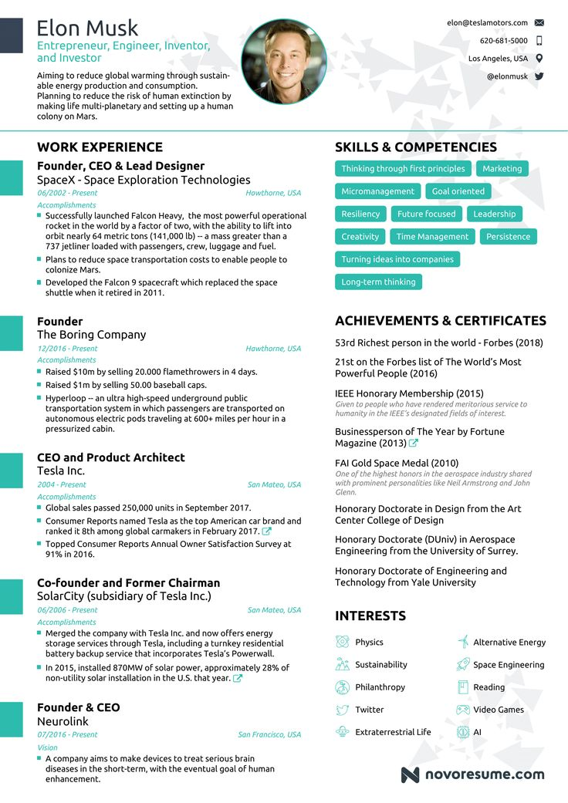

在求职过程中，简历既是求职者的敲门砖，也是个人品牌的集中体现。市场上对于理想简历页数的讨论一直众说纷纭，尽管没有一个硬性的规定，普遍认可的观点是保持简历在两页以内。然而，基于以下原因，我强烈推荐将简历控制在一页之内。

> 本文所指求职简历，不包括求学简历。因为，求学简历通常不同学校有特定的要求。

# 简历的本质

简历的核心目的是为了帮助求职者顺利通过面试并拿到 offer。一个优秀的简历应当：

## 1. 有助于通过面试或者拿到 offer

突出显示求职者的资格与岗位匹配。

## 2. 简历是应聘者的自荐信

简历必须真诚，无水分。
展现真实的经历与技能，无虚假夸大。

## 3. 给 HR 和面试官留下良好的深刻印象

通过简洁的经历介绍、清晰的排版布局、合适的字体以及专业的措辞，使自己在众多候选人中脱颖而出。

# 为何一页纸简历最佳

## 高效传达信息

一页纸的简历迫使求职者精简信息，只保留最有力的证据说明自己适合职位，从而让 HR 和面试官快速抓住重点。

## 简洁明了

字面含义，简历是指**简要**地描述自己的经历。

> 维基百科: In English, a **curriculum vitae** (English: Latin for "course of life", often shortened to **CV**) is a short written summary of a person's career, qualifications, and education.

在有限的空间内，突出展示最关键的成就和能力，避免无关信息的干扰。

## 专业印象

一页纸的简历给人以极高的职业素养与概括能力的印象，体现了求职者的专业性。

# 示例

